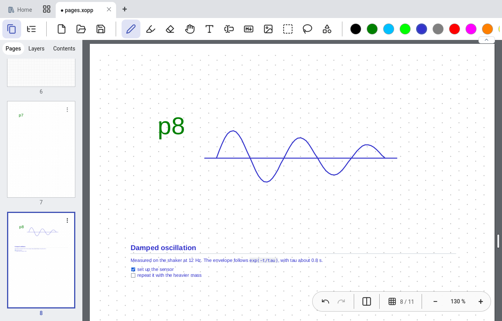
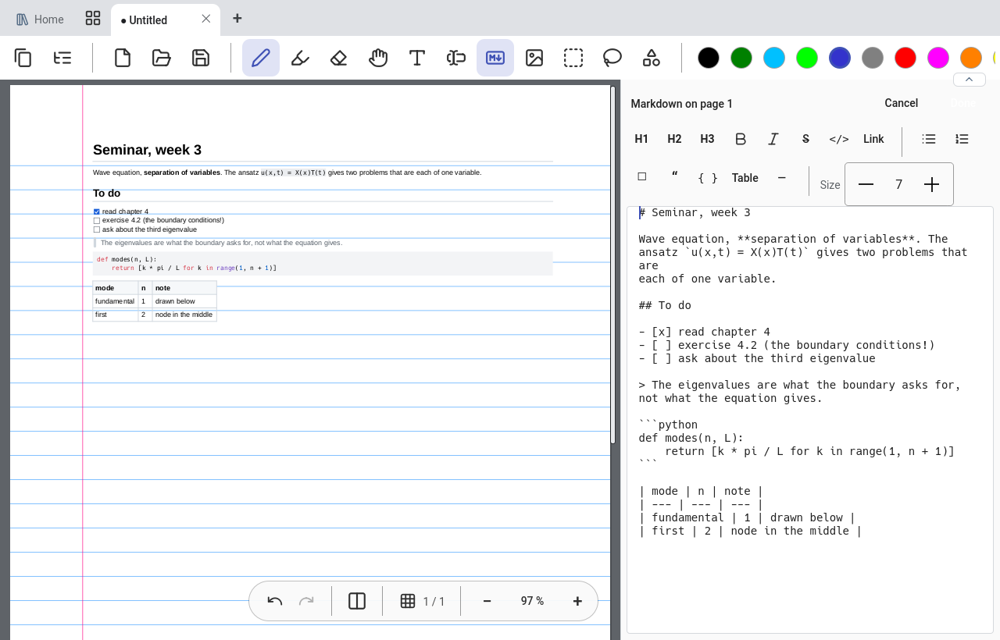
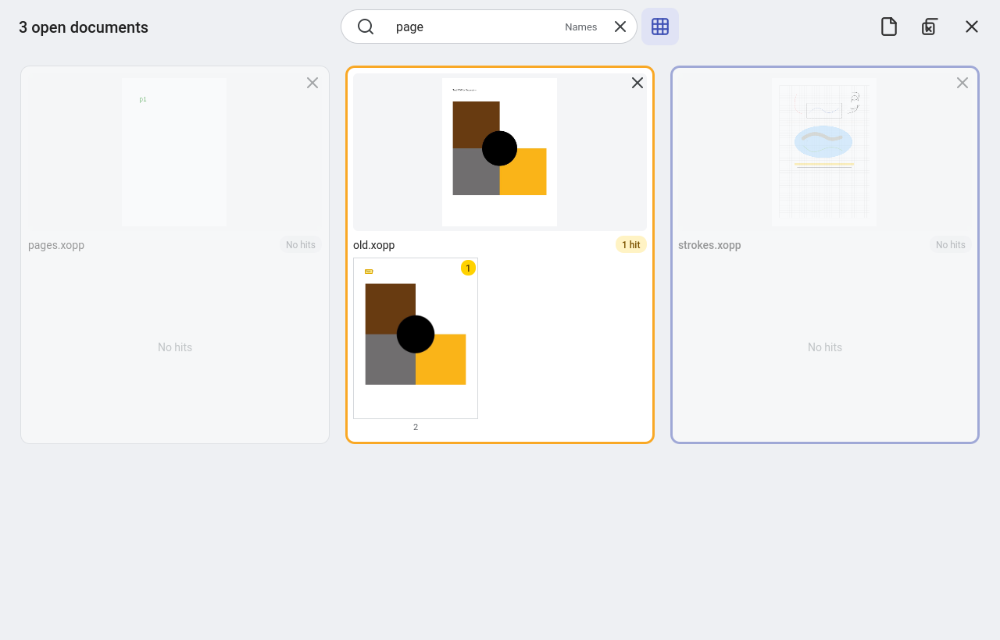
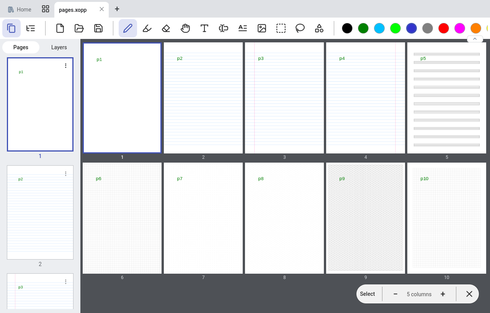

# xournal-qt

**Handwritten notes and PDF annotation on a pen tablet — a Qt 6 fork of [Xournal++](https://github.com/xournalpp/xournalpp).**
Same documents, same proven core, a new interface built for a pen in one hand and a finger in the other.

<br clear="left">



Its files *are* Xournal++ files. A document written here opens in Xournal++, and one written there opens here: the
document model, the `.xopp` file format, the cairo rendering, the undo stack and the tools are upstream's, unchanged.
What is new is everything around them — see [FORK.md](FORK.md) for how the two live in one tree.

## What it adds to Xournal++

| | |
| --- | --- |
| **Tabs and an overview** | Several documents at once, an overview of them all, and a tab can be dragged into a window of its own. |
| **A library** | Your folders of documents with previews, and a search over the text of every document in them (not only the open one). |
| **Markdown on the page** | Write Markdown on a page and see it formatted as you type. It flows onto the next pages, its headings become chapters, and it is stored as ordinary Xournal++ text. |
| **Pen, finger and mouse told apart** | The pen writes while your hand rests on the screen, a finger scrolls and zooms, the side buttons erase. Tuned on a convertible under Wayland. |
| **Pages at a glance** | A page sidebar and a zoomable grid of all pages, with copy, move, insert, delete and drag and drop. |
| **Made to keep up** | Pages are rendered ahead of where you read and kept in memory (you set the limit), every page has a preview drawn in the background, and previews are stored for the next opening. Flying through a 500-page PDF shows pages that turn sharp where you stop, not blanks. |
| **Built for touch** | Big handles, a movable tool pill in full screen, popups where your finger is, gestures for the overviews. |

Not there yet: audio recording, the plugin console and the LaTeX tool of Xournal++, and Windows and macOS builds
(the fork is Linux only so far).

## What that makes possible

- **Follow a lecture on one device.** The slides as a PDF in one tab, your own notes in another, both in the library.
  Write on the slides, jump between the two with Ctrl+Tab, and find that one word later with the search over all
  open documents.
- **Keep a lab or reading notebook that is still text.** Type the parts that are text as Markdown — headings, task
  lists, tables, code — and draw the rest by hand on the same page. The headings become the table of contents.
- **Work through a thick PDF.** Open it, scroll or fling; the pages are already rendered. The page grid shows
  everything at once, the search marks its hits on the page pictures, and the document opens where you left it.
- **Keep your notes where your files are.** No import, no hidden database: a library is a folder.



## A library is just a folder

Point it at a folder and that folder is a library. The documents in it are the files you already have; subfolders are
its shelves. Nothing is imported, copied or hidden away, and the folder stays yours to move, sync or back up with
whatever you already use.

- The libraries it offers by default live in **`~/Documents/Xournal_Libraries/`** (`Default` is the one it starts
  with). Your Downloads folder is offered as a quick library too.
- **Any folder can be opened as a library** — from the home screen, from the command line
  (`xournal-qt ~/some/folder`), or from Dolphin's "Open as Xournal Qt library".
- Each library keeps its own notes about itself in **`.xournal_library/`** inside it: the search index, the page
  previews, and which page of a document is its title page and where you stopped reading. It is a cache, not your
  data — delete it and it is built again the next time, and the documents are untouched.



## Trying it

Linux, Qt 6.5 or newer. Packages of a release and which one fits which system:
[qt/docs/releasing.md](qt/docs/releasing.md). From source:

```sh
qt/scripts/linux-deps.sh                                          # Debian / Ubuntu: what the build needs
cmake -S qt -B build-qt -G Ninja -DCMAKE_BUILD_TYPE=RelWithDebInfo
cmake --build build-qt
./build-qt/xournal-qt
```

More: [what it can do and where it is going](qt/docs/ROADMAP.md) · [Markdown boxes](qt/docs/markdown-boxes.md) ·
[the library](qt/docs/library.md) · [text mode](qt/docs/text-mode.md) · [how the fork is kept](FORK.md)



---

*Everything below is the README of upstream Xournal++, whose core this fork builds on.*

#   <br> Xournal++


[](https://dev.azure.com/xournalpp/xournalpp/_build/latest?definitionId=1&branchName=master)


## Translations

Would you like to see Xournal++ in your own language? Translators are welcome to contribute to Xournal++.

You can contribute translations on [Crowdin](https://crowdin.com/project/xournalpp/).

Interested in translating a new language? Discuss on [Matrix](https://matrix.to/#/#xournalpp_xournalpp:gitter.im) or create a [new issue](https://github.com/xournalpp/xournalpp/issues) to unlock the language on Crowdin.

**Thanks in advance!**

## Features

Xournal++ (/ˌzɚnl̟ˌplʌsˈplʌs/) is a hand note-taking software written in C++ with the target of flexibility, functionality and speed.
Stroke recognizer and other parts are based on Xournal Code, which you can find at [SourceForge](http://sourceforge.net/projects/xournal/).

Xournal++ features:

- Supports pressure-sensitive styluses and digital pen tables (e.g. Wacom, Huion, XP Pen, etc. tablets)
- Paper backgrounds for note-taking, scratch paper, or whiteboarding
- Annotate on top of PDFs
- Select text from the background PDF, copy, highlight or underline it or strike it through
- Follow links from the background PDF
- Export to a variety of formats including SVG, PNG and PDF, both from the GUI and command line
- Different drawing tools (e.g. pen, highlighter) and stroke styles (e.g. solid, dotted)
- Shape drawing (line, arrow, circle, rectangle, spline)
- Use the set-square and compass tools for measurements or as a guide for drawing straight lines, circular arcs and radii
- Fill shape functionality
- Shape resizing and rotation
- Rotation and grid snapping for precise alignment of objects
- Input stabilization for smoother writing/drawing
- Text tool for adding text in different fonts, colors, and sizes
- Enhanced support for image insertion
- Eraser with multiple configurations
- LaTeX support (requires a working LaTeX installation) with customizable template and a resizable editor with syntax highlighting
- Sidebar containing page previews with advanced page sorting, PDF bookmarks and layers (can be individually hidden/edited)
- Allows mapping different tools/colors etc. to stylus/mouse buttons
- Customizable toolbar with multiple configurations, e.g. to optimize toolbar for portrait/landscape
- Custom color palette support using the .gpl format
- Page template definitions
- Bug reporting, auto-save, and auto backup tools
- Audio recording and playback alongside with handwritten notes
- Multi language support (over 20 languages supported)
- Plugins using Lua scripting


<table>
<tr>
<td>

## GNU/Linux


</td><td>

## Windows 10


</td></tr><tr><td>

## macOS Catalina


</td><td>

## Xournal++ Mobile on Chromium OS


</td></tr><tr><td>

## Toolbar / Page Background / Layer

Multiple page background, easy selectable on the toolbar


</td><td>

## Layer sidebar and advanced layer selection


</td></tr><tr><td>

## Multiple predefined and fully customizable toolbars


</td></tr></table>

## User Guide

Check out the [website](https://xournalpp.github.io/guide/overview/) for a detailed user guide.

## Installing

The official releases of Xournal++ can be found on the
[Releases](https://github.com/xournalpp/xournalpp/releases) page. We provide
binaries for Debian, Ubuntu, macOS and Windows.
For other GNU/Linux distributions (or older/newer ones), we also provide an
AppImage that is binary compatible with any distribution released around or
after Ubuntu 22.04. For installing Xournal++ Mobile on handheld devices, please check out the [Mobile & web app section](#mobile--web-app)

**A note for Ubuntu/Debian users**: The official binaries that we provide are
only compatible with the _specific version of Debian or Ubuntu_ indicated by the
file name. For example, if you are on Ubuntu 20.04, the binary whose name
contains `Ubuntu-bionic` is _only_ compatible with Ubuntu 18.04. If your system
is not one of the specific Debian or Ubuntu versions that are supported by the
official binaries, we recommend you use either the PPA (Ubuntu only), the Flatpak, or the
AppImage.

There is also an _unstable_, [automated nightly
release](https://github.com/xournalpp/xournalpp/releases/tag/nightly) that
includes the very latest features and bug fixes.

With the help of the community, Xournal++ is also available on official repositories
of some popular GNU/Linux distros and platforms.

[](https://repology.org/project/xournalpp/versions)


### Debian

On Debian bookworm and Debian sid the `xournalpp` package (stable version) is contained in the official repositories. Simply install via

```sh
sudo apt install xournalpp
```

There are also the official [Stable releases](https://github.com/xournalpp/xournalpp/releases) and
_unstable_ [automated nightly releases](https://github.com/xournalpp/xournalpp/releases/tag/nightly).

### Ubuntu and derivatives

On distros based on Ubuntu 22.04 Jammy Jellyfish (and later) the `xournalpp` package (stable version) is contained in the official repositories.
Simply install via

```sh
sudo apt install xournalpp
```

#### Stable PPA
The latest stable version is available via the following [_unofficial_ PPA](https://github.com/xournalpp/xournalpp/issues/1013#issuecomment-692656810):

```sh
sudo add-apt-repository ppa:apandada1/xournalpp-stable
sudo apt update
sudo apt install xournalpp
```

#### Unstable PPA
An _unstable_, nightly release is available for Ubuntu-based distributions via the following PPA:

```sh
sudo add-apt-repository ppa:andreasbutti/xournalpp-master
sudo apt update
sudo apt install xournalpp
```

This PPA is provided by the Xournal++ team. While it has the latest features and
bug fixes, it has also not been tested thoroughly and may break periodically (we
try our best not to break things, though).

### Fedora

The [released version of
xournalpp](https://src.fedoraproject.org/rpms/xournalpp) is available in the
[main repository](https://bodhi.fedoraproject.org/updates/?packages=xournalpp)
via _Software_ application or the following command:

```sh
sudo dnf install xournalpp
```

or

```sh
pkcon install xournalpp
```

The bleeding edge packages synced to xournalpp git master on a daily basis are available from [COPR luya/xournalpp](https://copr.fedorainfracloud.org/coprs/luya/xournalpp/).
[](https://copr.fedorainfracloud.org/coprs/luya/xournalpp/package/xournalpp/)

### openSUSE

On openSUSE Tumbleweed, the released version of Xournal++ is available from the
main repository:

```sh
sudo zypper in xournalpp
```

For openSUSE Leap 15.0 and earlier, use the install link from
[X11:Utilities](https://software.opensuse.org//download.html?project=X11%3AUtilities&package=xournalpp).

For all versions of openSUSE, bleeding edge packages synced to xournalpp git
master on a weekly basis are available from
[home:badshah400:Staging](https://software.opensuse.org//download.html?project=home%3Abadshah400%3AStaging&package=xournalpp).

### Arch Linux

The latest stable release is available [in the [extra]
repository](https://www.archlinux.org/packages/extra/x86_64/xournalpp/).

To build the latest state of the master branch yourself, use [this AUR
package](https://aur.archlinux.org/packages/xournalpp-git/).

### Solus

The latest stable release is available in the main repository:

```sh
sudo eopkg it xournalpp
```


### Chrome OS

You can [enable the linux container](https://support.google.com/chromebook/answer/9145439?hl=en), and install the [Debian package](https://github.com/xournalpp/xournalpp?tab=readme-ov-file#debian) from the official Debian repositories.
```sh
sudo apt install xournalpp
```

### Flatpak

The Xournal++ team officially supports a [FlatHub
release](https://flathub.org/apps/details/com.github.xournalpp.xournalpp), which
can be installed with

```sh
flatpak install flathub com.github.xournalpp.xournalpp
```

Note that for Xournal++ to work properly, you must have at least one GTK theme
and one icon theme installed on Flatpak. To enable LaTeX support, you will also
need to install the TeX Live extension:

```sh
flatpak install flathub org.freedesktop.Sdk.Extension.texlive
```

The Flatpak manifest can be found at the [Xournal++ Flatpak packaging
repository](https://github.com/flathub/com.github.xournalpp.xournalpp), and all
Flatpak-related packaging issues should be reported there.

### Android

Android is supported by Xournal++ Mobile. It can be downloaded [from F-Droid](https://f-droid.org/en/packages/online.xournal.mobile/) or you can [build](#building-the-mobile-app) it.


### iOS

Unfortunately, the iOS app is not published yet in the Apple App Store. Read [this](#mobile--web-app) to learn, why. Anyway, in the [Building section](#building-the-mobile-app) you can learn how to build an early preview.

### Windows

Official Windows releases are provided on the [Releases
page](https://github.com/xournalpp/xournalpp/releases).

You can also download it from the Microsoft Store (supports automated updates):

<a href="https://apps.microsoft.com/detail/9nn1hhct0p1x?referrer=appbadge&mode=full" target="_blank"  rel="noopener noreferrer">
	
</a>

Our official GitHub release is also available via [winget](https://github.com/microsoft/winget-pkgs/tree/master/manifests/x/Xournal%2B%2B/Xournal%2B%2B). Open PowerShell and run:

```sh
winget install -e --id Xournal++.Xournal++
```

You can also install it via [Scoop](https://scoop.sh/):

```sh
scoop bucket add extras
scoop install extras/xournalpp
```
You can easily update Xournal++ with winget or scoop.


### macOS

Releases for macOS are provided on the [Releases
page](https://github.com/xournalpp/xournalpp/releases).
However, the app will refuse to run due to Apple policies (see https://github.com/xournalpp/xournalpp/issues/6185). Run the following commands one by one to make it work:
```
xattr -c /Applications/Xournal++.app
codesign --force --deep --sign - /Applications/Xournal++.app
```
And for those who type it out, don't forget to type the hyphen (`-`) between `--sign` and `/Applications/Xournal++.app`

## Building

We support building on three operating systems:

- [Linux](readme/LinuxBuild.md)
- [macOS](readme/MacBuild.md)
- [Windows](readme/WindowsBuild.md)
- [Windows on ARM (not officially supported)](readme/WindowsBuildArm.md)


## File format

The file extension `.xopp` is a gzipped XML file. PDFs are not embedded into the file, so if the PDF is deleted, the background is lost. `.xopp` is basically the same file format as `.xoj`, which is used by Xournal. Therefore, Xournal++ is able to read `.xoj` files, and can also export to `.xoj`. As soon as notes are exported to a `.xoj` file, all Xournal++ specific extensions like additional background types, are lost.

`.xopp` files can theoretically be read by Xournal, as long as you do not use any new features. Xournal does not open files that contain new attributes or unknown values, so Xournal++ will add the extension `.xopp` to all saved files to indicate the potential presence of Xournal++-only features.

All new files will be saved as `.xopp`. If an `.xoj` file that was created by Xournal is opened, the Save-As dialog will be displayed on save. If the `.xoj` file was created by Xournal++, the file will be overwritten on save and the file extension will not change.

**We are currently introducing a new file format that can efficiently store attached PDF files and other attachments internally. We will still allow for attachments that are linked to external files. Please refer to [#937](https://github.com/xournalpp/xournalpp/issues/937) for further details.**

## Mobile & web app

From mid 2020 to May 2021, a Flutter-written mobile app for **Android** and **iOS** (unreleased) and the **web**
has been developed, which supports the file format and most of the basic features of Xournal++.
Unfortunately development has stalled and we have lost contact to the (single) developer. The web app is no longer available.
You can still check out the [separate repository on GitLab](https://gitlab.com/TheOneWithTheBraid/xournalpp_mobile) or install it from [F-Droid](https://f-droid.org/en/packages/online.xournal.mobile/).

### Building the mobile app

- [Android Build](https://gitlab.com/TheOneWithTheBraid/xournalpp_mobile#getting-started)
- [iOS Build](https://gitlab.com/TheOneWithTheBraid/xournalpp_mobile#getting-started)

## Contributing

See [CONTRIBUTING.md](./CONTRIBUTING.md). If your pull request does not need Xournal++ to be built to test it (e.g. for a README update), you can prepend [skip ci] to the title of the commit to disable CI running.
