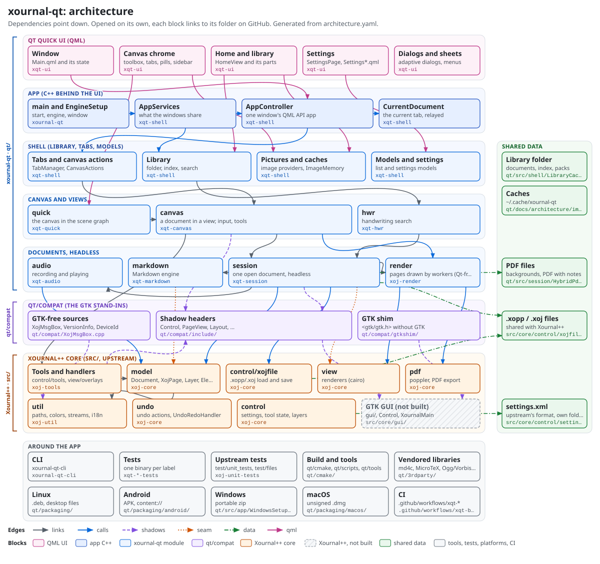

# Architecture

<!-- Generated by qt/scripts/architecture/generate.py from architecture.yaml. Edit the YAML, then run the script. -->

xournal-qt is a fork of Xournal++: upstream's C++ core in `src/` (the document model, the .xopp/.xoj files, undo, the tools, the cairo renderers, PDF through poppler), compiled without GTK, under a new Qt 6 / Qt Quick frontend in `qt/`. Dependencies point down: the QML UI talks to the app's C++, which uses the shell, the canvas and the headless document session, which build on the Xournal++ core. Between the two sits `qt/compat`: headers with upstream's names that stand in for the GTK classes upstream's code expects.

Each block below is a folder or a set of files with one job; most are one CMake target. Every edge says why it is there. The diagram shows the main edges; the tables and the interactive page show all of them.



**The interactive page**: [https://r-fehler.github.io/xournal-qt/](https://r-fehler.github.io/xournal-qt/) (click a block for its files and edges; filter the edges by kind), published from [`site/index.html`](site/index.html) by `.github/workflows/xqt-pages.yml`; it works offline from a checkout too. On GitHub the diagram above is a picture: the links are in the tables below. Opened on its own ([architecture.svg](architecture.svg)), its blocks link to their folders.

Edges, by kind:

| Kind | Means |
| --- | --- |
| `links` | a CMake target links another |
| `calls` | direct use: includes and calls |
| `shadows` | through qt/compat's shadow headers |
| `seam` | a hook or edit in an upstream file (ADR 0002) |
| `data` | reads or writes shared files |
| `qml` | QML to C++: `app`, registered types, image providers, models |

Sub-pages: [image caches](image-caches.md) (the pictures the app draws ahead and keeps, their owners and limits). Related: [ADR 0002](../decisions/0002-upstream-seams.md) (every seam in upstream files, the ports), [ADR 0003](../decisions/0003-app-services.md) (what the windows share), [AGENTS.md](../../../AGENTS.md) ("What the moving parts assume": threads, page revisions, memory owners).

## The layers

From the top of the diagram down; the shared data last. Each block: what it does, where it is, its key classes, what it depends on and what uses it.

### Qt Quick UI (QML)

The whole user interface, in QML: one window per `Main.qml`, its parts each in a file of its own. QML talks to C++ only through the context properties `app` (an AppController) and `win`, the types registered under `XournalQt.Canvas`, the image providers and the list models.

| Block | Responsibility | Target |
| --- | --- | --- |
| [Window](#window) | The window (`win`): its state objects (insets, view modes, chrome layout), its keys with the one ordered Esc/Back dispatcher, and the parts it instantiates. | `xqt-ui` |
| [Canvas chrome](#canvas-chrome) | What surrounds the canvas: the tab strip, the toolbox and top bar, the pills over the page (selection, note, view), the page sidebar and the page area that hosts the `DocumentCanvas` item. | `xqt-ui` |
| [Home and library](#home-and-library) | The home screen: the library grid, recent files, bookmarks, to-dos and tags, the library's search and its file operations. | `xqt-ui` |
| [Settings](#settings) | The settings page: one section per file (pen, touch, documents, display, search, storage, shortcuts, help) and the row types they are built of. | `xqt-ui` |
| [Dialogs and sheets](#dialogs-and-sheets) | Dialogs, menus and sheets that adapt from a desktop window to a phone (a dialog on a desktop, a sheet from the bottom on a phone), and the dialogs built on them. | `xqt-ui` |

#### Window

The window (`win`): its state objects (insets, view modes, chrome layout), its keys with the one ordered Esc/Back dispatcher, and the parts it instantiates.

**Where**: [`qt/src/app/qml/`](../../src/app/qml/). **Target**: `xqt-ui`. **Kind**: QML UI.

**Docs**: [app/README.md](../../src/app/README.md), [zen.md](../features/zen.md), [adaptive-layout.md](../features/adaptive-layout.md).

| Key class or file | What |
| --- | --- |
| [`Main.qml`](../../src/app/qml/Main.qml) | the window; holds the state objects and instantiates the parts |
| [`WindowInsets.qml, ViewModes.qml, ChromeLayout.qml`](../../src/app/qml/ViewModes.qml) | safe areas and keyboard (win.insets), full screen, Zen, read only, presenting (win.modes), where the chrome goes (win.layout) |
| [`WindowShortcuts.qml, PageKeys.qml`](../../src/app/qml/WindowShortcuts.qml) | the window's shortcuts and the ordered Esc/Back dispatcher |
| [`SaveFlow.qml, StartupFlow.qml, ExportFlow.qml`](../../src/app/qml/SaveFlow.qml) | multi-step flows (save as, the first start, export) |

Depends on:

- [AppController](#appcontroller) (`qml`): every action and property through the context property `app` (QmlApiTest checks the names)
- [Canvas chrome](#canvas-chrome) (`calls`): Main.qml instantiates the parts
- [Home and library](#home-and-library) (`calls`): Main.qml instantiates the home view

Used by:

- [main and EngineSetup](#main-and-enginesetup) (`qml`): loads the QML module XournalQt and its Main

#### Canvas chrome

What surrounds the canvas: the tab strip, the toolbox and top bar, the pills over the page (selection, note, view), the page sidebar and the page area that hosts the `DocumentCanvas` item.

**Where**: [`qt/src/app/qml/`](../../src/app/qml/). **Target**: `xqt-ui`. **Kind**: QML UI.

**Docs**: [toolbox.md](../features/toolbox.md), [reference-view.md](../features/reference-view.md).

| Key class or file | What |
| --- | --- |
| [`PageArea.qml`](../../src/app/qml/PageArea.qml) | the canvas area of a tab |
| [`Toolbox.qml, ToolboxMenus.qml, AppButtons.qml`](../../src/app/qml/Toolbox.qml) | the user's pens and tools, the top bar's buttons |
| [`TabStrip.qml`](../../src/app/qml/TabStrip.qml) | the tabs |
| [`SelectionPill.qml, NotePill.qml, ViewPill.qml`](../../src/app/qml/SelectionPill.qml) | the pills over the page; they act on a CanvasActions (app.edit) |
| [`PageSidebar.qml, PageGrid.qml`](../../src/app/qml/PageSidebar.qml) | page previews (image://thumbnail, image://sketch) |
| [`ReferenceSplit.qml`](../../src/app/qml/ReferenceSplit.qml) | a second document beside the first (the reference view) |

Depends on:

- [AppController](#appcontroller) (`qml`): the tabs, the tools, app.edit (a CanvasActions)
- [quick](#quick) (`qml`): the DocumentCanvas item (import XournalQt.Canvas), AdaptiveLayout, TouchGestures
- [Pictures and caches](#pictures-and-caches) (`qml`): image://thumbnail and image://sketch in the sidebar and page grid

Used by:

- [Window](#window) (`calls`): Main.qml instantiates the parts

#### Home and library

The home screen: the library grid, recent files, bookmarks, to-dos and tags, the library's search and its file operations.

**Where**: [`qt/src/app/qml/`](../../src/app/qml/). **Target**: `xqt-ui`. **Kind**: QML UI.

**Docs**: [library.md](../features/library.md).

| Key class or file | What |
| --- | --- |
| [`HomeView.qml`](../../src/app/qml/HomeView.qml) | the home screen; instantiates its parts once each |
| [`LibraryGridPage.qml, RecentGridPage.qml, DocumentCard.qml`](../../src/app/qml/LibraryGridPage.qml) | the grids and a document's card (image://cover) |
| [`BookmarksView.qml, TodosView.qml, TagsView.qml`](../../src/app/qml/TodosView.qml) | the library's bookmarks, to-dos and tags |

Depends on:

- [Library](#library) (`qml`): the library's list models (app.library, recent files, bookmarks, to-dos, tags)
- [Pictures and caches](#pictures-and-caches) (`qml`): image://cover, image://hitpage, image://mdsnippet

Used by:

- [Window](#window) (`calls`): Main.qml instantiates the home view

#### Settings

The settings page: one section per file (pen, touch, documents, display, search, storage, shortcuts, help) and the row types they are built of.

**Where**: [`qt/src/app/qml/`](../../src/app/qml/). **Target**: `xqt-ui`. **Kind**: QML UI.

| Key class or file | What |
| --- | --- |
| [`SettingsPage.qml`](../../src/app/qml/SettingsPage.qml) | the page and its navigation |
| [`SettingsPen.qml, SettingsDocuments.qml, …`](../../src/app/qml/SettingsPen.qml) | the sections; they read and write SettingsModel |
| [`SettingsSwitchRow.qml, SettingsSliderRow.qml`](../../src/app/qml/SettingsSwitchRow.qml) | the row types |

Depends on:

- [Models and settings](#models-and-settings) (`qml`): SettingsModel, ShortcutsModel, ToolboxModel

#### Dialogs and sheets

Dialogs, menus and sheets that adapt from a desktop window to a phone (a dialog on a desktop, a sheet from the bottom on a phone), and the dialogs built on them.

**Where**: [`qt/src/app/qml/`](../../src/app/qml/). **Target**: `xqt-ui`. **Kind**: QML UI.

**Docs**: [adaptive-layout.md](../features/adaptive-layout.md).

| Key class or file | What |
| --- | --- |
| [`AdaptiveDialog.qml`](../../src/app/qml/AdaptiveDialog.qml) | a dialog or a bottom sheet, by the window's size class |
| [`AdaptiveMenu.qml, MenuSheet.qml`](../../src/app/qml/AdaptiveMenu.qml) | a menu or a sheet |
| [`NewDocumentDialog.qml, BackgroundDialog.qml, PrintDialog.qml`](../../src/app/qml/NewDocumentDialog.qml) | examples of the dialogs built on them |
| [`Popups.js`](../../src/app/qml/Popups.js) | helpers for popups |

Depends on:

- [AppController](#appcontroller) (`qml`): the dialogs' actions through `app`

### App (C++ behind the UI)

What the windows of the process share (AppServices), one window's QML API (AppController) and the program's start (main.cpp). Compiled into `xqt-shell` (the C++) and `xournal-qt` (main.cpp).

| Block | Responsibility | Target |
| --- | --- | --- |
| [main and EngineSetup](#main-and-enginesetup) | Starts the program: the platform's setup, the AppServices, the QML engine with its image providers and the context property `app`, then the main window from the QML module `XournalQt`. | `xournal-qt` |
| [AppServices](#appservices) | One per process: owns AppContext, the library and its lists, the toolbox, shortcuts, handwriting search, the window factory, the open documents of every window and the background jobs quitting waits for. | `xqt-shell` |
| [AppController](#appcontroller) | One window's QML API, the context property `app`: its tabs, the current document's properties and every action the UI offers; the `App*.cpp` files beside it hold one area each. | `xqt-shell` |
| [CurrentDocument](#currentdocument) | The current tab's DocumentSession and CanvasView with their signals relayed in one place; a window follows a tab change with one call. | `xqt-shell` |

#### main and EngineSetup

Starts the program: the platform's setup, the AppServices, the QML engine with its image providers and the context property `app`, then the main window from the QML module `XournalQt`.

**Where**: [`qt/src/app/main.cpp`](../../src/app/main.cpp), [`qt/src/app/EngineSetup.cpp`](../../src/app/EngineSetup.cpp). **Target**: `xournal-qt`. **Kind**: app (C++).

**Docs**: [app/README.md](../../src/app/README.md).

| Key class or file | What |
| --- | --- |
| [`main.cpp`](../../src/app/main.cpp) | the program's start (target xournal-qt) |
| [`EngineSetup`](../../src/app/EngineSetup.h) | the engine as the app and the UI tests set it up (image providers, `app`) |

Depends on:

- [Window](#window) (`qml`): loads the QML module XournalQt and its Main
- [AppServices](#appservices) (`calls`): makes the services before the first window, drops them after the last
- [quick](#quick) (`links`): xournal-qt links xqt-quick (registers XournalQt.Canvas)
- [Pictures and caches](#pictures-and-caches) (`calls`): EngineSetup registers the image providers

Used by:

- [Android](#android) (`calls`): AndroidSetup before the core starts; the activity hosts the app
- [Windows](#windows) (`calls`): WindowsSetup, WindowsFonts before the core starts
- [Linux](#linux) (`calls`): installs the program with its desktop files and MIME types; the .deb
- [macOS](#macos) (`calls`): the app bundle around the program

#### AppServices

One per process: owns AppContext, the library and its lists, the toolbox, shortcuts, handwriting search, the window factory, the open documents of every window and the background jobs quitting waits for.

**Where**: [`qt/src/app/AppServices.h`](../../src/app/AppServices.h), [`qt/src/app/OpenDocuments.h`](../../src/app/OpenDocuments.h), [`qt/src/app/BackgroundJobs.h`](../../src/app/BackgroundJobs.h). **Target**: `xqt-shell`. **Kind**: app (C++).

**Docs**: [0003-app-services.md](../decisions/0003-app-services.md).

| Key class or file | What |
| --- | --- |
| [`AppServices`](../../src/app/AppServices.h) | the process-wide objects and the window factory |
| [`OpenDocuments`](../../src/app/OpenDocuments.h) | the windows; "this file, wherever it is open" |
| [`BackgroundJobs`](../../src/app/BackgroundJobs.h) | the app's work off the UI thread, awaited at shutdown |

Depends on:

- [AppController](#appcontroller) (`calls`): the window factory makes one AppController per window
- [Library](#library) (`calls`): owns the library, its lists and the library's ink job
- [session](#session) (`calls`): owns the AppContext (settings, tool, render workers)
- [hwr](#hwr) (`calls`): owns the handwriting search

Used by:

- [main and EngineSetup](#main-and-enginesetup) (`calls`): makes the services before the first window, drops them after the last

#### AppController

One window's QML API, the context property `app`: its tabs, the current document's properties and every action the UI offers; the `App*.cpp` files beside it hold one area each.

**Where**: [`qt/src/app/AppController.h`](../../src/app/AppController.h), [`qt/src/app/AppController.cpp`](../../src/app/AppController.cpp). **Target**: `xqt-shell`. **Kind**: app (C++).

**Docs**: [app/README.md](../../src/app/README.md), [app-cpp.md](../review/2026-10/app-cpp.md).

| Key class or file | What |
| --- | --- |
| [`AppController`](../../src/app/AppController.h) | the QML API of one window |
| [`App*.cpp`](../../src/app/AppBookmarks.cpp) | one area each: bookmarks, tags, templates, stickers, snip, text files, … |
| [`AudioControl`](../../src/app/AudioControl.h) | recording and playing (app.audio) |
| [`TimelineControl`](../../src/app/TimelineControl.h) | the replay of how a page was written (app.timeline) |

Depends on:

- [CurrentDocument](#currentdocument) (`calls`): follows the current tab
- [Tabs and canvas actions](#tabs-and-canvas-actions) (`calls`): TabManager (its tabs), CanvasActions (app.edit), ReferenceMode, PresenterConsole
- [Models and settings](#models-and-settings) (`calls`): the per-document lists and the settings models
- [audio](#audio) (`calls`): AudioControl records and plays (app.audio)
- [control](#control) (`calls`): upstream's Settings (the xournalQt part) and the ToolHandler

Used by:

- [Window](#window) (`qml`): every action and property through the context property `app` (QmlApiTest checks the names)
- [Canvas chrome](#canvas-chrome) (`qml`): the tabs, the tools, app.edit (a CanvasActions)
- [Dialogs and sheets](#dialogs-and-sheets) (`qml`): the dialogs' actions through `app`
- [AppServices](#appservices) (`calls`): the window factory makes one AppController per window

#### CurrentDocument

The current tab's DocumentSession and CanvasView with their signals relayed in one place; a window follows a tab change with one call.

**Where**: [`qt/src/app/CurrentDocument.h`](../../src/app/CurrentDocument.h). **Target**: `xqt-shell`. **Kind**: app (C++).

**Docs**: [0003-app-services.md](../decisions/0003-app-services.md).

| Key class or file | What |
| --- | --- |
| [`CurrentDocument`](../../src/app/CurrentDocument.h) | follow() on a tab change, announce() once set up |

Depends on:

- [session](#session) (`calls`): relays the current DocumentSession's signals
- [canvas](#canvas) (`calls`): relays the current CanvasView's signals

Used by:

- [AppController](#appcontroller) (`calls`): follows the current tab

### Shell (library, tabs, models)

Everything between the documents and the QML that is not a canvas: the library, the tabs, what acts on a canvas, the image providers and their caches, the list and settings models. One target, `xqt-shell`.

| Block | Responsibility | Target |
| --- | --- | --- |
| [Tabs and canvas actions](#tabs-and-canvas-actions) | The window's controllers: the tabs (each owns its session and view), what acts on one canvas, the reference view, version comparison, the presenter console, recovery after a crash. | `xqt-shell` |
| [Library](#library) | The library: a plain folder of documents, its index of every document's text and notes, its search, file operations, sharing and archives, and the list models of the home screen. | `xqt-shell` |
| [Pictures and caches](#pictures-and-caches) | The QML image providers (thumbnails, sketches, covers, hit pages, snippets, annotation pictures), their caches with one owner of their memory and one owner of their worker threads. | `xqt-shell` |
| [Models and settings](#models-and-settings) | The list models of one document (pages, outline, layers, annotations, versions) and the settings-like models (settings.xml's keys, shortcuts, the toolbox, palettes). | `xqt-shell` |

#### Tabs and canvas actions

The window's controllers: the tabs (each owns its session and view), what acts on one canvas, the reference view, version comparison, the presenter console, recovery after a crash.

**Where**: [`qt/src/shell/`](../../src/shell/). **Target**: `xqt-shell`. **Kind**: xournal-qt module.

**Docs**: [shell/README.md](../../src/shell/README.md), [0003-app-services.md](../decisions/0003-app-services.md), [presenter-view.md](../features/presenter-view.md).

| Key class or file | What |
| --- | --- |
| [`TabManager`](../../src/shell/TabManager.h) | owns each tab's DocumentSession and CanvasView |
| [`CanvasActions`](../../src/shell/CanvasActions.h) | what acts on one canvas (app.edit, app.reference.edit) |
| [`ReferenceMode`](../../src/shell/ReferenceMode.h) | a second document beside the first |
| [`SessionRecovery`](../../src/shell/SessionRecovery.h) | emergency saves and the recovery offer (port of upstream's CrashHandler) |
| [`PresenterConsole`](../../src/shell/PresenterConsole.h) | the presenter's view and the audience window |

Depends on:

- [canvas](#canvas) (`links`): xqt-shell links xqt-canvas: a tab owns its CanvasView, CanvasActions acts on one
- [session](#session) (`calls`): a tab owns its DocumentSession; SessionRecovery saves every tab

Used by:

- [AppController](#appcontroller) (`calls`): TabManager (its tabs), CanvasActions (app.edit), ReferenceMode, PresenterConsole

#### Library

The library: a plain folder of documents, its index of every document's text and notes, its search, file operations, sharing and archives, and the list models of the home screen.

**Where**: [`qt/src/shell/`](../../src/shell/). **Target**: `xqt-shell`. **Kind**: xournal-qt module.

**Docs**: [library.md](../features/library.md), [tags.md](../features/tags.md), [todos.md](../features/todos.md).

| Key class or file | What |
| --- | --- |
| [`Library`](../../src/shell/Library.h) | the folder, its documents, file operations |
| [`LibraryIndex`](../../src/shell/LibraryIndex.h) | the text and notes of every document, and the search |
| [`LibraryModel`](../../src/shell/LibraryModel.h) | the grid and its file operations (QML list model) |
| [`RecentFiles, LibraryBookmarks, LibraryTodos, LibraryTags`](../../src/shell/RecentFiles.h) | the home screen's other lists |
| [`LibraryInkJob`](../../src/shell/LibraryInkJob.h) | reads the handwriting of the library's documents |

Depends on:

- [hwr](#hwr) (`links`): xqt-shell links xqt-hwr: LibraryInkJob reads the library's handwriting
- [session](#session) (`calls`): reads documents for the index (DocumentTextIndex, Tags, the PDF formats)
- [Library folder](#library-folder) (`data`): the folder, its index and packs

Used by:

- [Home and library](#home-and-library) (`qml`): the library's list models (app.library, recent files, bookmarks, to-dos, tags)
- [AppServices](#appservices) (`calls`): owns the library, its lists and the library's ink job

#### Pictures and caches

The QML image providers (thumbnails, sketches, covers, hit pages, snippets, annotation pictures), their caches with one owner of their memory and one owner of their worker threads.

**Where**: [`qt/src/shell/`](../../src/shell/). **Target**: `xqt-shell`. **Kind**: xournal-qt module.

**Docs**: [image-caches.md](image-caches.md).

| Key class or file | What |
| --- | --- |
| [`Thumbnails`](../../src/shell/Thumbnails.h) | image://thumbnail (port of upstream's PreviewJob) |
| [`PageSketches`](../../src/shell/PageSketches.h) | image://sketch and the canvas's stand-ins |
| [`DocumentCovers`](../../src/shell/DocumentCovers.h) | image://cover, the cards of the library |
| [`ImageMemory`](../../src/shell/ImageMemory.h) | the limits of all image caches |
| [`ImageWorkers`](../../src/shell/ImageWorkers.h) | the threads of all image providers |
| [`AsyncImage`](../../src/shell/AsyncImage.h) | the shared response, LRU cache and URL encoding |

Depends on:

- [render](#render) (`calls`): RegionRender for pictures of areas
- [view](#view) (`calls`): draws thumbnails and covers with DocumentView (as upstream's PreviewJob)
- [pdf](#pdf) (`calls`): draws PDF pages for covers and hit pages
- [Caches](#caches) (`data`): stand-ins and covers on disk, named by page revision

Used by:

- [Canvas chrome](#canvas-chrome) (`qml`): image://thumbnail and image://sketch in the sidebar and page grid
- [Home and library](#home-and-library) (`qml`): image://cover, image://hitpage, image://mdsnippet
- [main and EngineSetup](#main-and-enginesetup) (`calls`): EngineSetup registers the image providers

#### Models and settings

The list models of one document (pages, outline, layers, annotations, versions) and the settings-like models (settings.xml's keys, shortcuts, the toolbox, palettes).

**Where**: [`qt/src/shell/`](../../src/shell/). **Target**: `xqt-shell`. **Kind**: xournal-qt module.

**Docs**: [toolbox.md](../features/toolbox.md), [color-palettes.md](../features/color-palettes.md).

| Key class or file | What |
| --- | --- |
| [`PagesModel`](../../src/shell/PagesModel.h) | the pages of the current document |
| [`OutlineModel, LayersModel, AnnotationsModel, VersionsModel`](../../src/shell/LayersModel.h) | per-document lists of the side panels |
| [`SettingsModel`](../../src/shell/SettingsModel.h) | upstream's settings.xml keys and the fork's (its xournalQt part) |
| [`ToolboxModel`](../../src/shell/ToolboxModel.h) | the toolbox rail and the top bar |
| [`ShortcutsModel`](../../src/shell/ShortcutsModel.h) | the keyboard shortcuts |

Depends on:

- [session](#session) (`calls`): pages, outline, layers, annotations, versions of a session
- [control](#control) (`calls`): settings.xml through upstream's Settings; layers through LayerController
- [settings.xml](#settingsxml) (`data`): the settings page writes settings.xml

Used by:

- [Settings](#settings) (`qml`): SettingsModel, ShortcutsModel, ToolboxModel
- [AppController](#appcontroller) (`calls`): the per-document lists and the settings models

### Canvas and views

A document shown in a view (canvas), the view in the Qt Quick scene graph (quick), and handwriting search (hwr), which reads the ink of the sessions.

| Block | Responsibility | Target |
| --- | --- | --- |
| [quick](#quick) | The bridge between a CanvasView and the Qt Quick scene graph: page tiles as scene graph nodes, an event filter that takes all canvas input, dark pages on the GPU, the window's size class. | `xqt-quick` |
| [canvas](#canvas) | A DocumentSession shown in a view: the visible pages and their rendering, the input on them (pen, touch, mouse, palm rejection), and the tools and editors that work on a page. | `xqt-canvas` |
| [hwr](#hwr) | Reads handwriting in the background (ONNX Runtime, loaded at run time) so the search finds it; the ink is never converted. | `xqt-hwr` |

#### quick

The bridge between a CanvasView and the Qt Quick scene graph: page tiles as scene graph nodes, an event filter that takes all canvas input, dark pages on the GPU, the window's size class.

**Where**: [`qt/src/quick/`](../../src/quick/). **Target**: `xqt-quick`. **Kind**: xournal-qt module.

**Docs**: [quick/README.md](../../src/quick/README.md), [0001-ui-host.md](../decisions/0001-ui-host.md), [dark-pages.md](../features/dark-pages.md).

| Key class or file | What |
| --- | --- |
| [`DocumentCanvasItem`](../../src/quick/DocumentCanvasItem.h) | the QQuickItem that shows one CanvasView (QML type DocumentCanvas) |
| [`DarkTileMaterial`](../../src/quick/DarkTileMaterial.h) | dark pages on the GPU (shaders in shaders/) |
| [`AdaptiveLayout`](../../src/quick/AdaptiveLayout.h) | the window's size class and touch profile (win.adaptive) |
| [`TouchGestures`](../../src/quick/TouchGestures.h) | four- and five-finger gestures for the window |

Depends on:

- [canvas](#canvas) (`links`): xqt-quick links xqt-canvas: DocumentCanvasItem shows a CanvasView and passes it all input

Used by:

- [Canvas chrome](#canvas-chrome) (`qml`): the DocumentCanvas item (import XournalQt.Canvas), AdaptiveLayout, TouchGestures
- [main and EngineSetup](#main-and-enginesetup) (`links`): xournal-qt links xqt-quick (registers XournalQt.Canvas)

#### canvas

A DocumentSession shown in a view: the visible pages and their rendering, the input on them (pen, touch, mouse, palm rejection), and the tools and editors that work on a page. Qt Gui, no Qt Quick.

**Where**: [`qt/src/canvas/`](../../src/canvas/). **Target**: `xqt-canvas`. **Kind**: xournal-qt module.

**Docs**: [canvas/README.md](../../src/canvas/README.md), [pen-gestures.md](../features/pen-gestures.md), [sticky-notes.md](../features/sticky-notes.md).

| Key class or file | What |
| --- | --- |
| [`CanvasView`](../../src/canvas/CanvasView.h) | a session in a view: visible pages, rendering, selection, clipboard, links; implements the shadows XournalView and Layout |
| [`CanvasPage`](../../src/canvas/CanvasPage.h) | one page in a view, the tools' dispatch; implements the shadow XojPageView (port of gui/PageView.cpp) |
| [`CanvasInput`](../../src/canvas/CanvasInput.h) | pen, touch, mouse; palm rejection, gestures (port of upstream's input handlers) |
| [`DocumentLayout, ViewController`](../../src/canvas/ViewController.h) | where pages lie; zoom and scroll (port of gui/Layout and ZoomControl) |
| [`CanvasMemory`](../../src/canvas/CanvasMemory.h) | the memory for rendered pages, shared by every view |
| [`TextEditor, MarkdownEditor`](../../src/canvas/MarkdownEditor.h) | typing on the page |
| [`StickyNotes, Snip, PenGestures, GeometryToolLayer`](../../src/canvas/StickyNotes.h) | the fork's tools on the page |

Depends on:

- [session](#session) (`links`): xqt-canvas links xqt-session: a view shows a session; edits go through its undo
- [render](#render) (`calls`): PageRaster per visible page, rendered by the RenderService's workers
- [Tools and handlers](#tools-and-handlers) (`links`): xqt-canvas links xoj-tools: CanvasPage drives StrokeHandler, EraseHandler, EditSelection, the shape handlers
- [Shadow headers](#shadow-headers) (`shadows`): CanvasPage implements XojPageView (gui/PageView.h); CanvasView implements XournalView and Layout; ViewController feeds ZoomControl
- [undo](#undo) (`calls`): upstream's undo actions for edits made outside the tools (groups, notes, page resize)
- [model](#model) (`calls`): pages, layers and elements under the document lock
- [control](#control) (`calls`): ToolHandler, LayerController, the shape recogniser, the settings

Used by:

- [CurrentDocument](#currentdocument) (`calls`): relays the current CanvasView's signals
- [Tabs and canvas actions](#tabs-and-canvas-actions) (`links`): xqt-shell links xqt-canvas: a tab owns its CanvasView, CanvasActions acts on one
- [quick](#quick) (`links`): xqt-quick links xqt-canvas: DocumentCanvasItem shows a CanvasView and passes it all input

#### hwr

Reads handwriting in the background (ONNX Runtime, loaded at run time) so the search finds it; the ink is never converted.

**Where**: [`qt/src/hwr/`](../../src/hwr/). **Target**: `xqt-hwr`. **Kind**: xournal-qt module.

**Docs**: [hwr/README.md](../../src/hwr/README.md), [handwriting-search.md](../features/handwriting-search.md).

| Key class or file | What |
| --- | --- |
| [`HandwritingSearch`](../../src/hwr/HandwritingSearch.h) | the setting, the recognisers, the worker, an indexer per document |
| [`InkLayout`](../../src/hwr/InkLayout.h) | a page's ink as lines and words |
| [`InkRecognitionService`](../../src/hwr/InkRecognitionService.h) | the one worker thread at idle priority |
| [`OrtRuntime`](../../src/hwr/OrtRuntime.h) | ONNX Runtime loaded at run time |

Depends on:

- [session](#session) (`links`): xqt-hwr links xqt-session: an indexer per open document reads its strokes
- [Vendored libraries](#vendored-libraries) (`calls`): ONNX Runtime's C API, loaded at run time

Used by:

- [AppServices](#appservices) (`calls`): owns the handwriting search
- [Library](#library) (`links`): xqt-shell links xqt-hwr: LibraryInkJob reads the library's handwriting
- [CLI](#cli) (`links`): xournal-qt-cli links xqt-hwr: handwriting as text in exports

### Documents, headless

One open document without a view (session), and what it builds on: the Markdown engine, recordings, and the Qt-free render workers. The CLI and the tests use these without a window.

| Block | Responsibility | Target |
| --- | --- | --- |
| [audio](#audio) | Records and plays Ogg Vorbis, compatible with Xournal++'s audio (a stroke tied to a moment of a recording). | `xqt-audio` |
| [markdown](#markdown) | Parses (md4c), lays out (Pango), paginates and draws (cairo) Markdown text, with the same text stack as upstream's text elements; registers the renderer upstream's TextView asks for Markdown texts. | `xqt-markdown` |
| [session](#session) | One open document without a view: load, new, save in the background, autosave, undo, page revisions; the fork's formats (the PDF with notes, incremental saves, version history), search; process-wide AppContext. | `xqt-session` |
| [render](#render) | Turns a page of upstream's model into pixels with upstream's views and cairo, on worker threads; Qt-free, so the CLI and the tests use it too. | `xoj-render` |

#### audio

Records and plays Ogg Vorbis, compatible with Xournal++'s audio (a stroke tied to a moment of a recording).

**Where**: [`qt/src/audio/`](../../src/audio/). **Target**: `xqt-audio`. **Kind**: xournal-qt module.

**Docs**: [audio/README.md](../../src/audio/README.md), [audio.md](../features/audio.md).

| Key class or file | What |
| --- | --- |
| [`Recorder, Player`](../../src/audio/Recorder.h) | recording and playing |
| [`DocumentAudio`](../../src/audio/DocumentAudio.h) | a document's recordings and the elements tied to them |
| [`OggVorbis`](../../src/audio/OggVorbis.h) | Ogg Vorbis with the vendored libogg/libvorbis |

Depends on:

- [model](#model) (`calls`): the ts/fn of strokes and texts, a page's voice memos; an undo action
- [Vendored libraries](#vendored-libraries) (`links`): libogg, libvorbis

Used by:

- [AppController](#appcontroller) (`calls`): AudioControl records and plays (app.audio)
- [session](#session) (`links`): xqt-session links xqt-audio: recordings tied to elements

#### markdown

Parses (md4c), lays out (Pango), paginates and draws (cairo) Markdown text, with the same text stack as upstream's text elements; registers the renderer upstream's TextView asks for Markdown texts.

**Where**: [`qt/src/markdown/`](../../src/markdown/). **Target**: `xqt-markdown`. **Kind**: xournal-qt module.

**Docs**: [markdown/README.md](../../src/markdown/README.md), [markdown-boxes.md](../features/markdown-boxes.md).

| Key class or file | What |
| --- | --- |
| [`MdDocument`](../../src/markdown/MdDocument.h) | a parsed text as blocks of formatted runs |
| [`MdLayout`](../../src/markdown/MdLayout.h) | laid out for a width, drawn with cairo |
| [`MdBox`](../../src/markdown/MdBox.h) | Markdown boxes on pages; sets the hooks of model/MarkdownText.h |
| [`MdMath`](../../src/markdown/MdMath.h) | formulas by MicroTeX |

Depends on:

- [model](#model) (`seam`): MdBox registers xoj::markdown::renderer, sizer and layoutPainter (model/MarkdownText.h), so Text and TextView draw Markdown
- [view](#view) (`seam`): TextView draws a Markdown text through the registered renderer; the emoji through layoutPainter
- [Vendored libraries](#vendored-libraries) (`links`): md4c, MicroTeX

Used by:

- [session](#session) (`links`): xqt-session links xqt-markdown: text documents, Markdown boxes in exports

#### session

One open document without a view: load, new, save in the background, autosave, undo, page revisions; the fork's formats (the PDF with notes, incremental saves, version history), search; process-wide AppContext.

**Where**: [`qt/src/session/`](../../src/session/). **Target**: `xqt-session`. **Kind**: xournal-qt module.

**Docs**: [session/README.md](../../src/session/README.md), [hybrid-pdf.md](../features/hybrid-pdf.md).

| Key class or file | What |
| --- | --- |
| [`DocumentSession`](../../src/session/DocumentSession.h) | one open document (one tab); implements the shadow Control (port of parts of upstream's Control) |
| [`AppContext`](../../src/session/AppContext.h) | process-wide: upstream's Settings, the ToolHandler, templates, render workers, the UI-thread dispatcher |
| [`HeadlessViews, SessionActions`](../../src/session/HeadlessViews.h) | the session's side of the shadows MainWindow, XournalView, ActionDatabase |
| [`HybridPdf`](../../src/session/HybridPdf.h) | the PDF with notes (ink as annotations, the .xopp embedded) |
| [`FileIo`](../../src/session/FileIo.h) | one atomic write with fsync, locks, stamps, hashes |
| [`PageOrderUndoAction`](../../src/session/PageOrderUndoAction.h) | an upstream-style undo action of the fork (several pages in one step) |
| [`StickyNote, ElementGroups, ElementTimes, PageMargins`](../../src/session/StickyNote.h) | the fork's features in the document model (several through seams) |

Depends on:

- [render](#render) (`links`): xqt-session links xoj-render: render workers in AppContext, drawing for exports
- [markdown](#markdown) (`links`): xqt-session links xqt-markdown: text documents, Markdown boxes in exports
- [audio](#audio) (`links`): xqt-session links xqt-audio: recordings tied to elements
- [control/xojfile](#controlxojfile) (`calls`): loads with LoadHandler and saves with SaveHandler (in the background, on a page copy)
- [control/xojfile](#controlxojfile) (`seam`): the fork's attributes (xqt-group, xqt-created, xqt-bookmark, xqt-audio, xqt-fill-color, notespace); a document loaded from memory (an encrypted PDF's .xopp)
- [undo](#undo) (`calls`): one UndoRedoHandler per session, plus one for page order
- [model](#model) (`calls`): the Document it owns; listens to its changes
- [model](#model) (`seam`): Document::setDocumentHandler, setPdfPassword, DocumentOutline; NoteSpace, page bookmarks, groups and times of elements
- [view](#view) (`seam`): StickyNote draws a note's layer (xoj::view::layerDrawer); PageMargins scales ruled paper (xoj::view::ruledScale)
- [util](#util) (`seam`): AppContext sets the UI-thread dispatcher (Util::setUiThreadDispatcher)
- [pdf](#pdf) (`calls`): opens PDFs and exports them (the PDF with notes builds on the cairo export)
- [control](#control) (`calls`): Settings and ToolHandler in AppContext; LayerController; PdfCache
- [Shadow headers](#shadow-headers) (`shadows`): DocumentSession implements Control; HeadlessViews implement MainWindow, XournalView; SessionActions implements ActionDatabase
- [.xopp / .xoj files](#xopp--xoj-files) (`data`): opens and saves documents (atomically, through FileIo)
- [PDF files](#pdf-files) (`data`): annotates PDFs; writes the PDF with notes

Used by:

- [AppServices](#appservices) (`calls`): owns the AppContext (settings, tool, render workers)
- [CurrentDocument](#currentdocument) (`calls`): relays the current DocumentSession's signals
- [Tabs and canvas actions](#tabs-and-canvas-actions) (`calls`): a tab owns its DocumentSession; SessionRecovery saves every tab
- [Library](#library) (`calls`): reads documents for the index (DocumentTextIndex, Tags, the PDF formats)
- [Models and settings](#models-and-settings) (`calls`): pages, outline, layers, annotations, versions of a session
- [hwr](#hwr) (`links`): xqt-hwr links xqt-session: an indexer per open document reads its strokes
- [canvas](#canvas) (`links`): xqt-canvas links xqt-session: a view shows a session; edits go through its undo
- [CLI](#cli) (`links`): xournal-qt-cli links xqt-session: the PDF with notes and the archive PDF
- [Tests](#tests) (`calls`): one test binary per module, label per module

#### render

Turns a page of upstream's model into pixels with upstream's views and cairo, on worker threads; Qt-free, so the CLI and the tests use it too.

**Where**: [`qt/src/render/`](../../src/render/). **Target**: `xoj-render`. **Kind**: xournal-qt module.

**Docs**: [render/README.md](../../src/render/README.md), [hidpi.md](../features/hidpi.md).

| Key class or file | What |
| --- | --- |
| [`PageRaster`](../../src/render/PageRaster.h) | the raster of one page as a view shows it (port of upstream's RenderJob) |
| [`RenderService`](../../src/render/RenderService.h) | the worker pool (port of upstream's Scheduler, several threads) |
| [`RegionRender`](../../src/render/RegionRender.h) | a picture of an area of a page |
| [`PaperTexture`](../../src/render/PaperTexture.h) | textured paper through upstream's backgroundDecorator hook |

Depends on:

- [view](#view) (`calls`): draws with DocumentView, LayerView and the background views, as upstream's RenderJob
- [view](#view) (`seam`): PaperTexture wraps backgrounds (xoj::view::backgroundDecorator)
- [pdf](#pdf) (`calls`): PDF backgrounds drawn outside the document lock (PdfCache, poppler)
- [model](#model) (`calls`): reads pages under std::shared\_lock

Used by:

- [Pictures and caches](#pictures-and-caches) (`calls`): RegionRender for pictures of areas
- [canvas](#canvas) (`calls`): PageRaster per visible page, rendered by the RenderService's workers
- [session](#session) (`links`): xqt-session links xoj-render: render workers in AppContext, drawing for exports
- [Upstream tests](#upstream-tests) (`links`): xoj-unit-tests links xoj-render: the fork's PageRasterTest and RegionRenderTest run in the same binary

### qt/compat (the GTK stand-ins)

Headers with upstream's names placed before upstream's include paths, so upstream's files compile without GTK and without edits: shadows of the GTK application classes (implemented by the fork), a GTK type shim, and GTK-free implementations of a few upstream files.

| Block | Responsibility | Target |
| --- | --- | --- |
| [GTK-free sources](#gtk-free-sources) | GTK-free implementations of a few upstream headers, compiled into xoj-util and xoj-tools instead of upstream's: message boxes through a pluggable sink (QML dialogs in the app, stderr in the CLI), the version, device identity. |  |
| [Shadow headers](#shadow-headers) | Headers with the path and API of upstream's GTK application classes (Control, MainWindow, XournalView, XojPageView, Layout, ZoomControl, ActionDatabase, LaserPointerHandler), abstract or GTK-free: the reused upstream code calls them, the fork implements them. |  |
| [GTK shim](#gtk-shim) | Plain GDK/GTK types with GDK 3 values and pure-cairo helpers ported from GDK 3; any real GTK call in compiled upstream code is a compile error by design. |  |

#### GTK-free sources

GTK-free implementations of a few upstream headers, compiled into xoj-util and xoj-tools instead of upstream's: message boxes through a pluggable sink (QML dialogs in the app, stderr in the CLI), the version, device identity.

**Where**: [`qt/compat/XojMsgBox.cpp`](../../compat/XojMsgBox.cpp), [`qt/compat/VersionInfo.cpp`](../../compat/VersionInfo.cpp), [`qt/compat/DeviceId.cpp`](../../compat/DeviceId.cpp). **Kind**: qt/compat.

**Docs**: [0002-upstream-seams.md](../decisions/0002-upstream-seams.md).

| Key class or file | What |
| --- | --- |
| [`XojMsgBox`](../../compat/include/util/XojMsgBox.h) | upstream's message boxes, sent to xoj::compat::MessageSink |
| [`VersionInfo.cpp`](../../compat/VersionInfo.cpp) | upstream's util/VersionInfo.h without GTK |
| [`DeviceId.cpp`](../../compat/DeviceId.cpp) | an input device's identity (a QPointingDevice address) |

Depends on:

- [util](#util) (`shadows`): compiled into xoj-util in place of upstream's XojMsgBox.cpp and VersionInfo.cpp (DeviceId.cpp into xoj-tools)

#### Shadow headers

Headers with the path and API of upstream's GTK application classes (Control, MainWindow, XournalView, XojPageView, Layout, ZoomControl, ActionDatabase, LaserPointerHandler), abstract or GTK-free: the reused upstream code calls them, the fork implements them.

**Where**: [`qt/compat/include/`](../../compat/include/). **Kind**: qt/compat.

**Docs**: [compat/README.md](../../compat/README.md), [0002-upstream-seams.md](../decisions/0002-upstream-seams.md).

| Key class or file | What |
| --- | --- |
| [`control/Control.h`](../../compat/include/control/Control.h) | a per-document session; implemented by DocumentSession |
| [`gui/PageView.h`](../../compat/include/gui/PageView.h) | XojPageView as the tools see it; implemented by CanvasPage |
| [`gui/Layout.h, gui/XournalView.h`](../../compat/include/gui/Layout.h) | page geometry and the views; implemented by CanvasView |
| [`gui/MainWindow.h`](../../compat/include/gui/MainWindow.h) | the window as reused code reaches it; implemented by session/HeadlessViews |
| [`control/zoom/ZoomControl.h`](../../compat/include/control/zoom/ZoomControl.h) | zoom values for reused tools, fed by ViewController |
| [`control/actions/ActionDatabase.h`](../../compat/include/control/actions/ActionDatabase.h) | an action sink; implemented by SessionActions |

Depends on:

- [GTK GUI (not built)](#gtk-gui-not-built) (`shadows`): stand in for the GTK classes Control, MainWindow, XournalView, XojPageView, Layout (not built)

Used by:

- [canvas](#canvas) (`shadows`): CanvasPage implements XojPageView (gui/PageView.h); CanvasView implements XournalView and Layout; ViewController feeds ZoomControl
- [session](#session) (`shadows`): DocumentSession implements Control; HeadlessViews implement MainWindow, XournalView; SessionActions implements ActionDatabase
- [Tools and handlers](#tools-and-handlers) (`shadows`): the handlers call Control, XojPageView, ZoomControl, … through the shadow headers
- [undo](#undo) (`shadows`): undo actions reach the views through Control
- [control](#control) (`shadows`): LayerController calls Control

#### GTK shim

Plain GDK/GTK types with GDK 3 values and pure-cairo helpers ported from GDK 3; any real GTK call in compiled upstream code is a compile error by design.

**Where**: [`qt/compat/gtkshim/`](../../compat/gtkshim/). **Kind**: qt/compat.

**Docs**: [compat/README.md](../../compat/README.md).

| Key class or file | What |
| --- | --- |
| [`gdk/gdk.h`](../../compat/gtkshim/gdk/gdk.h) | GdkRGBA, GdkRectangle, … and the gdk\_cairo\_\* helpers |
| [`gtk/gtk.h`](../../compat/gtkshim/gtk/gtk.h) | GtkMessageType, GtkResponseType, opaque handles |

Depends on:

- [GTK GUI (not built)](#gtk-gui-not-built) (`shadows`): &lt;gtk/gtk.h&gt; and &lt;gdk/gdk.h&gt; of every xoj-\* target resolve to the shim: GDK/GTK types without GTK

### Xournal++ core (src/, upstream)

Upstream Xournal++'s C++ core, compiled unmodified (apart from the seams of ADR 0002) from the explicit list in `qt/cmake/XojSources.cmake` into three static libraries: `xoj-util`, `xoj-core` and `xoj-tools`. Upstream's GTK GUI is not built.

| Block | Responsibility | Target |
| --- | --- | --- |
| [Tools and handlers](#tools-and-handlers) | Upstream's input handlers (pen, eraser, shapes, spline, selection, PDF text selection) and the overlays that draw a stroke or a selection while it is made; compiled unmodified against the shadow headers. | `xoj-tools` |
| [model](#model) | The document model: a document of pages of layers of elements (strokes, texts, images, TeX images, links), page backgrounds, the document lock and the listeners told of every change. | `xoj-core` |
| [control/xojfile](#controlxojfile) | Reading and writing Xournal++'s files: the XML parser that builds a document, the save handler that writes one, gzip and attached backgrounds. | `xoj-core` |
| [view](#view) | Draws pages with cairo: a document, its layers and elements, the backgrounds (ruled, graph, PDF, image); what makes the fork's pixels identical to upstream's. | `xoj-core` |
| [pdf](#pdf) | Reading PDFs through poppler-glib (pages, text, links, outline) and exporting documents as PDF (cairo or qpdf backend). | `xoj-core` |
| [util](#util) | Upstream's utilities: paths (the config folder), colors, rectangles, gzip and zip streams, serializing, logging, and the UI-thread dispatch (a seam the fork sets). | `xoj-util` |
| [undo](#undo) | Upstream's undo: one action class per kind of edit and the handler that stacks them; the fork adds its own actions of the same shape. | `xoj-core` |
| [control](#control) | The GTK-free parts of upstream's control layer: settings.xml, the tool in hand, page types, layers, the shape recogniser, the PDF page cache and the image export. | `xoj-core` |
| [GTK GUI (not built)](#gtk-gui-not-built) | Upstream's GTK application: the main window, page views, input handlers, dialogs, Control, the jobs and the plugins. |  |

#### Tools and handlers

Upstream's input handlers (pen, eraser, shapes, spline, selection, PDF text selection) and the overlays that draw a stroke or a selection while it is made; compiled unmodified against the shadow headers.

**Where**: [`src/core/control/tools/`](../../../src/core/control/tools/), [`src/core/view/overlays/`](../../../src/core/view/overlays/). **Target**: `xoj-tools`. **Kind**: Xournal++ core.

**Docs**: [XojSources.cmake](../../cmake/XojSources.cmake).

| Key class or file | What |
| --- | --- |
| [`StrokeHandler`](../../../src/core/control/tools/StrokeHandler.h) | a stroke being drawn, its stabilizer, the shape recogniser |
| [`EraseHandler`](../../../src/core/control/tools/EraseHandler.h) | the eraser |
| [`EditSelection`](../../../src/core/control/tools/EditSelection.h) | a selection being moved, scaled, rotated |
| [`Selector, PdfElemSelection`](../../../src/core/control/tools/Selector.h) | selecting elements, selecting PDF text |
| [`BaseShapeHandler, SplineHandler`](../../../src/core/control/tools/BaseShapeHandler.h) | rectangles, ellipses, arrows, rulers, splines |
| [`StrokeToolView, SelectorView`](../../../src/core/view/overlays/StrokeToolView.h) | the overlays drawn while a tool works |

Depends on:

- [Shadow headers](#shadow-headers) (`shadows`): the handlers call Control, XojPageView, ZoomControl, … through the shadow headers
- [model](#model) (`links`): xoj-tools links xoj-core: the handlers make and change elements
- [undo](#undo) (`calls`): every finished stroke or edit is an undo action

Used by:

- [canvas](#canvas) (`links`): xqt-canvas links xoj-tools: CanvasPage drives StrokeHandler, EraseHandler, EditSelection, the shape handlers

#### model

The document model: a document of pages of layers of elements (strokes, texts, images, TeX images, links), page backgrounds, the document lock and the listeners told of every change.

**Where**: [`src/core/model/`](../../../src/core/model/). **Target**: `xoj-core`. **Kind**: Xournal++ core.

| Key class or file | What |
| --- | --- |
| [`Document`](../../../src/core/model/Document.h) | the pages, the PDF background, the lock |
| [`XojPage`](../../../src/core/model/XojPage.h) | a page, its background and layers |
| [`Layer`](../../../src/core/model/Layer.h) | a layer of elements |
| [`Element, Stroke, Text, Image`](../../../src/core/model/Element.h) | the elements |
| [`DocumentListener, DocumentHandler`](../../../src/core/model/DocumentListener.h) | change events (the session and the views listen) |
| [`MarkdownText.h`](../../../src/core/model/MarkdownText.h) | the hooks a frontend sets to draw Markdown texts (a seam of the fork) |

Depends on:

- [util](#util) (`links`): xoj-core links xoj-util

Used by:

- [canvas](#canvas) (`calls`): pages, layers and elements under the document lock
- [session](#session) (`calls`): the Document it owns; listens to its changes
- [session](#session) (`seam`): Document::setDocumentHandler, setPdfPassword, DocumentOutline; NoteSpace, page bookmarks, groups and times of elements
- [markdown](#markdown) (`seam`): MdBox registers xoj::markdown::renderer, sizer and layoutPainter (model/MarkdownText.h), so Text and TextView draw Markdown
- [audio](#audio) (`calls`): the ts/fn of strokes and texts, a page's voice memos; an undo action
- [render](#render) (`calls`): reads pages under std::shared\_lock
- [Tools and handlers](#tools-and-handlers) (`links`): xoj-tools links xoj-core: the handlers make and change elements
- [view](#view) (`calls`): draws pages, layers and elements
- [control/xojfile](#controlxojfile) (`calls`): builds and walks the Document
- [undo](#undo) (`calls`): changes the model
- [Upstream tests](#upstream-tests) (`calls`): upstream's suites run against the Qt-free core

#### control/xojfile

Reading and writing Xournal++'s files: the XML parser that builds a document, the save handler that writes one, gzip and attached backgrounds.

**Where**: [`src/core/control/xojfile/`](../../../src/core/control/xojfile/), [`src/core/control/xml/`](../../../src/core/control/xml/). **Target**: `xoj-core`. **Kind**: Xournal++ core.

| Key class or file | What |
| --- | --- |
| [`LoadHandler`](../../../src/core/control/xojfile/LoadHandler.h) | builds a Document from a .xopp/.xoj (or from memory, a seam) |
| [`XmlParser`](../../../src/core/control/xojfile/XmlParser.cpp) | the parser; passes the fork's xqt-\* attributes to the builder |
| [`SaveHandler`](../../../src/core/control/xojfile/SaveHandler.h) | writes a Document as .xopp |
| [`XmlAttrs.h`](../../../src/core/control/xojfile/XmlAttrs.h) | the attribute names (the fork's xqt-\* ones too) |

Depends on:

- [model](#model) (`calls`): builds and walks the Document
- [.xopp / .xoj files](#xopp--xoj-files) (`data`): the format's reader and writer

Used by:

- [session](#session) (`calls`): loads with LoadHandler and saves with SaveHandler (in the background, on a page copy)
- [session](#session) (`seam`): the fork's attributes (xqt-group, xqt-created, xqt-bookmark, xqt-audio, xqt-fill-color, notespace); a document loaded from memory (an encrypted PDF's .xopp)
- [CLI](#cli) (`calls`): loads documents as upstream's CLI does

#### view

Draws pages with cairo: a document, its layers and elements, the backgrounds (ruled, graph, PDF, image); what makes the fork's pixels identical to upstream's.

**Where**: [`src/core/view/`](../../../src/core/view/), [`src/core/view/background/`](../../../src/core/view/background/). **Target**: `xoj-core`. **Kind**: Xournal++ core.

| Key class or file | What |
| --- | --- |
| [`DocumentView`](../../../src/core/view/DocumentView.h) | draws a page (background and layers) |
| [`LayerView, StrokeView, TextView, ImageView`](../../../src/core/view/LayerView.h) | layers and elements |
| [`BackgroundView`](../../../src/core/view/background/BackgroundView.h) | the page backgrounds; PdfBackgroundView draws a PDF page through PdfCache |
| [`Mask`](../../../src/core/view/Mask.h) | an offscreen surface (used by PageRaster) |

Depends on:

- [model](#model) (`calls`): draws pages, layers and elements
- [pdf](#pdf) (`calls`): PdfBackgroundView draws a PDF page through PdfCache

Used by:

- [Pictures and caches](#pictures-and-caches) (`calls`): draws thumbnails and covers with DocumentView (as upstream's PreviewJob)
- [session](#session) (`seam`): StickyNote draws a note's layer (xoj::view::layerDrawer); PageMargins scales ruled paper (xoj::view::ruledScale)
- [markdown](#markdown) (`seam`): TextView draws a Markdown text through the registered renderer; the emoji through layoutPainter
- [render](#render) (`calls`): draws with DocumentView, LayerView and the background views, as upstream's RenderJob
- [render](#render) (`seam`): PaperTexture wraps backgrounds (xoj::view::backgroundDecorator)

#### pdf

Reading PDFs through poppler-glib (pages, text, links, outline) and exporting documents as PDF (cairo or qpdf backend).

**Where**: [`src/core/pdf/base/`](../../../src/core/pdf/base/), [`src/core/pdf/popplerapi/`](../../../src/core/pdf/popplerapi/). **Target**: `xoj-core`. **Kind**: Xournal++ core.

| Key class or file | What |
| --- | --- |
| [`XojPdfDocument, XojPdfPage`](../../../src/core/pdf/base/XojPdfDocument.h) | a PDF and its pages, behind an interface |
| [`PopplerGlibDocument`](../../../src/core/pdf/popplerapi/PopplerGlibDocument.h) | the poppler implementation |
| [`XojCairoPdfExport`](../../../src/core/pdf/base/XojCairoPdfExport.h) | PDF export with cairo |
| [`XojPdfExportFactory`](../../../src/core/pdf/base/XojPdfExportFactory.h) | picks the export backend |

Used by:

- [Pictures and caches](#pictures-and-caches) (`calls`): draws PDF pages for covers and hit pages
- [session](#session) (`calls`): opens PDFs and exports them (the PDF with notes builds on the cairo export)
- [render](#render) (`calls`): PDF backgrounds drawn outside the document lock (PdfCache, poppler)
- [view](#view) (`calls`): PdfBackgroundView draws a PDF page through PdfCache
- [CLI](#cli) (`calls`): PDF export with upstream's flags

#### util

Upstream's utilities: paths (the config folder), colors, rectangles, gzip and zip streams, serializing, logging, and the UI-thread dispatch (a seam the fork sets).

**Where**: [`src/util/`](../../../src/util/). **Target**: `xoj-util`. **Kind**: Xournal++ core.

| Key class or file | What |
| --- | --- |
| [`Util.h`](../../../src/util/include/util/Util.h) | execInUiThread through a pluggable dispatcher (seam) |
| [`PathUtil`](../../../src/util/PathUtil.cpp) | config and cache folders (xournal-qt's own, a seam) |
| [`Color, Rectangle, serializing/`](../../../src/util/include/util/Color.h) | small types used everywhere |

Used by:

- [session](#session) (`seam`): AppContext sets the UI-thread dispatcher (Util::setUiThreadDispatcher)
- [GTK-free sources](#gtk-free-sources) (`shadows`): compiled into xoj-util in place of upstream's XojMsgBox.cpp and VersionInfo.cpp (DeviceId.cpp into xoj-tools)
- [model](#model) (`links`): xoj-core links xoj-util

#### undo

Upstream's undo: one action class per kind of edit and the handler that stacks them; the fork adds its own actions of the same shape.

**Where**: [`src/core/undo/`](../../../src/core/undo/). **Target**: `xoj-core`. **Kind**: Xournal++ core.

| Key class or file | What |
| --- | --- |
| [`UndoRedoHandler`](../../../src/core/undo/UndoRedoHandler.h) | the undo and redo stacks |
| [`UndoAction`](../../../src/core/undo/UndoAction.h) | the base of every action |
| [`InsertUndoAction, DeleteUndoAction, MoveUndoAction, …`](../../../src/core/undo/InsertUndoAction.h) | one per kind of edit |

Depends on:

- [Shadow headers](#shadow-headers) (`shadows`): undo actions reach the views through Control
- [model](#model) (`calls`): changes the model

Used by:

- [canvas](#canvas) (`calls`): upstream's undo actions for edits made outside the tools (groups, notes, page resize)
- [session](#session) (`calls`): one UndoRedoHandler per session, plus one for page order
- [Tools and handlers](#tools-and-handlers) (`calls`): every finished stroke or edit is an undo action

#### control

The GTK-free parts of upstream's control layer: settings.xml, the tool in hand, page types, layers, the shape recogniser, the PDF page cache and the image export.

**Where**: [`src/core/control/settings/`](../../../src/core/control/settings/), [`src/core/control/layer/`](../../../src/core/control/layer/), [`src/core/control/pagetype/`](../../../src/core/control/pagetype/), [`src/core/control/shaperecognizer/`](../../../src/core/control/shaperecognizer/). **Target**: `xoj-core`. **Kind**: Xournal++ core.

| Key class or file | What |
| --- | --- |
| [`Settings`](../../../src/core/control/settings/Settings.h) | settings.xml (the fork keeps its keys in a custom part) |
| [`ToolHandler`](../../../src/core/control/ToolHandler.h) | the tool in hand, its size and color |
| [`LayerController`](../../../src/core/control/layer/LayerController.h) | layers of a page (through the shadow Control) |
| [`PdfCache`](../../../src/core/control/PdfCache.h) | rendered PDF pages for the background views |
| [`ShapeRecognizer`](../../../src/core/control/shaperecognizer/ShapeRecognizer.h) | strokes to shapes |
| [`ImageExport, ExportHelper`](../../../src/core/control/jobs/ImageExport.h) | PNG/SVG export (the CLI's and the app's) |

Depends on:

- [Shadow headers](#shadow-headers) (`shadows`): LayerController calls Control
- [settings.xml](#settingsxml) (`data`): Settings reads and writes settings.xml

Used by:

- [AppController](#appcontroller) (`calls`): upstream's Settings (the xournalQt part) and the ToolHandler
- [Models and settings](#models-and-settings) (`calls`): settings.xml through upstream's Settings; layers through LayerController
- [canvas](#canvas) (`calls`): ToolHandler, LayerController, the shape recogniser, the settings
- [session](#session) (`calls`): Settings and ToolHandler in AppContext; LayerController; PdfCache
- [CLI](#cli) (`calls`): PNG/SVG export (ImageExport)

#### GTK GUI (not built)

Upstream's GTK application: the main window, page views, input handlers, dialogs, Control, the jobs and the plugins. Not compiled by the Qt build; qt/compat stands in for what reused code needs of it, and the fork ported a few classes (ADR 0002, "Ported, not reused").

**Where**: [`src/core/gui/`](../../../src/core/gui/), [`src/core/control/Control.cpp`](../../../src/core/control/Control.cpp), [`src/exe/`](../../../src/exe/). **Kind**: Xournal++, not built.

**Docs**: [0002-upstream-seams.md](../decisions/0002-upstream-seams.md).

| Key class or file | What |
| --- | --- |
| [`control/Control.cpp`](../../../src/core/control/Control.cpp) | the GTK application object (shadowed by qt/compat's Control.h) |
| [`gui/PageView.cpp`](../../../src/core/gui/PageView.cpp) | XojPageView, ported to canvas/CanvasPage |
| [`gui/inputdevices/`](../../../src/core/gui/inputdevices/) | the input handlers, ported to canvas/CanvasInput |
| [`control/jobs/RenderJob.cpp`](../../../src/core/control/jobs/RenderJob.cpp) | page rendering, ported to render/PageRaster |
| [`src/exe/`](../../../src/exe/) | upstream's main() |

Depends on:

- [.xopp / .xoj files](#xopp--xoj-files) (`data`): Xournal++ itself opens the same files

Used by:

- [Shadow headers](#shadow-headers) (`shadows`): stand in for the GTK classes Control, MainWindow, XournalView, XojPageView, Layout (not built)
- [GTK shim](#gtk-shim) (`shadows`): &lt;gtk/gtk.h&gt; and &lt;gdk/gdk.h&gt; of every xoj-\* target resolve to the shim: GDK/GTK types without GTK
- [Build and tools](#build-and-tools) (`calls`): XojSources.cmake lists what of src/ is built (GTK parts not)

### Around the app

The headless CLI, the tests, the developer tools, the vendored libraries, the platform layers and CI.

| Block | Responsibility | Target |
| --- | --- | --- |
| [CLI](#cli) | Headless export with upstream's flags (PNG, SVG, PDF, the PDF with notes); the golden tests' driver. | `xournal-qt-cli` |
| [Tests](#tests) | One GoogleTest binary per module and label (unit session canvas markdown audio hwr quick shell ui), shared helpers, the UI fixture that drives the real window off-screen, the golden tests. | `xqt-*-tests` |
| [Upstream tests](#upstream-tests) | Upstream's unit tests, run against the Qt-free core, and its fixtures (read only: tests never write into test/files). | `xoj-unit-tests` |
| [Build and tools](#build-and-tools) | The build (which upstream sources become which library), the environment and CI scripts, the upstream merge and developer tools. |  |
| [Vendored libraries](#vendored-libraries) | Libraries compiled in: md4c and MicroTeX (Markdown), libogg and libvorbis (audio), ONNX Runtime's C headers (hwr), gemoji. |  |
| [Linux](#linux) | Desktop files, MIME types and the .deb package; the main platform. |  |
| [Android](#android) | The APK: the manifest and Java activity, the setup before the core starts, Android's content:// files. |  |
| [Windows](#windows) | The portable zip: the setup before the core starts, Pango's fonts, the deployment. |  |
| [macOS](#macos) | The unsigned .dmg: the bundle's Info.plist and the deployment. |  |
| [CI](#ci) | The fork's workflows: the doc and architecture checks, both Linux Qt versions, the block tests in shards, the releases, the platform builds, this page on GitHub Pages. |  |

#### CLI

Headless export with upstream's flags (PNG, SVG, PDF, the PDF with notes); the golden tests' driver.

**Where**: [`qt/cli/`](../../cli/). **Target**: `xournal-qt-cli`. **Kind**: tools.

| Key class or file | What |
| --- | --- |
| [`main.cpp`](../../cli/main.cpp) | the CLI |

Depends on:

- [session](#session) (`links`): xournal-qt-cli links xqt-session: the PDF with notes and the archive PDF
- [hwr](#hwr) (`links`): xournal-qt-cli links xqt-hwr: handwriting as text in exports
- [control/xojfile](#controlxojfile) (`calls`): loads documents as upstream's CLI does
- [pdf](#pdf) (`calls`): PDF export with upstream's flags
- [control](#control) (`calls`): PNG/SVG export (ImageExport)

#### Tests

One GoogleTest binary per module and label (unit session canvas markdown audio hwr quick shell ui), shared helpers, the UI fixture that drives the real window off-screen, the golden tests.

**Where**: [`qt/tests/`](../../tests/). **Target**: `xqt-*-tests`. **Kind**: tests.

**Docs**: [testing/README.md](../testing/README.md).

| Key class or file | What |
| --- | --- |
| [`support/TestSupport.h`](../../tests/support/TestSupport.h) | waiting for a state, files, test PDFs |
| [`ui/UiFixture.h`](../../tests/ui/UiFixture.h) | the real window off-screen |
| [`golden/run_golden.sh`](../../tests/golden/run_golden.sh) | CLI output pixel-identical to upstream's |

Depends on:

- [session](#session) (`calls`): one test binary per module, label per module
- [Upstream tests](#upstream-tests) (`data`): the fixtures in test/files (read only)

Used by:

- [CI](#ci) (`calls`): builds and runs the suite (xqt-build, xqt-block-tests)

#### Upstream tests

Upstream's unit tests, run against the Qt-free core, and its fixtures (read only: tests never write into test/files).

**Where**: [`test/unit_tests/`](../../../test/unit_tests/), [`test/files/`](../../../test/files/). **Target**: `xoj-unit-tests`. **Kind**: tests.

| Key class or file | What |
| --- | --- |
| [`unit_tests/control/LoadHandlerTest.cpp`](../../../test/unit_tests/control/LoadHandlerTest.cpp) | one of the upstream suites the Qt build runs |
| [`XojTests.cmake`](../../cmake/XojTests.cmake) | which upstream suites are compiled |

Depends on:

- [model](#model) (`calls`): upstream's suites run against the Qt-free core
- [render](#render) (`links`): xoj-unit-tests links xoj-render: the fork's PageRasterTest and RegionRenderTest run in the same binary

Used by:

- [Tests](#tests) (`data`): the fixtures in test/files (read only)

#### Build and tools

The build (which upstream sources become which library), the environment and CI scripts, the upstream merge and developer tools.

**Where**: [`qt/cmake/`](../../cmake/), [`qt/scripts/`](../../scripts/), [`qt/tools/`](../../tools/). **Kind**: tools.

**Docs**: [building.md](../development/building.md).

| Key class or file | What |
| --- | --- |
| [`XojSources.cmake`](../../cmake/XojSources.cmake) | the allowlist of upstream sources |
| [`XojCore.cmake`](../../cmake/XojCore.cmake) | xoj-util, xoj-core, xoj-tools, xoj-render; compat before upstream's includes |
| [`merge-upstream.sh`](../../tools/merge-upstream.sh) | merging upstream Xournal++ |
| [`linux-deps.sh`](../../scripts/linux-deps.sh) | the build dependencies |

Depends on:

- [GTK GUI (not built)](#gtk-gui-not-built) (`calls`): XojSources.cmake lists what of src/ is built (GTK parts not)

#### Vendored libraries

Libraries compiled in: md4c and MicroTeX (Markdown), libogg and libvorbis (audio), ONNX Runtime's C headers (hwr), gemoji.

**Where**: [`qt/3rdparty/`](../../3rdparty/). **Kind**: tools.

| Key class or file | What |
| --- | --- |
| [`md4c/`](../../3rdparty/md4c/) | the Markdown parser |
| [`microtex/`](../../3rdparty/microtex/) | formulas |
| [`onnxruntime/`](../../3rdparty/onnxruntime/) | ONNX Runtime's C API headers |

Used by:

- [markdown](#markdown) (`links`): md4c, MicroTeX
- [audio](#audio) (`links`): libogg, libvorbis
- [hwr](#hwr) (`calls`): ONNX Runtime's C API, loaded at run time

#### Linux

Desktop files, MIME types and the .deb package; the main platform.

**Where**: [`qt/packaging/`](../../packaging/), [`qt/cmake/XqtPackage.cmake`](../../cmake/XqtPackage.cmake). **Kind**: platform.

**Docs**: [releasing.md](../development/releasing.md).

| Key class or file | What |
| --- | --- |
| [`XqtPackage.cmake`](../../cmake/XqtPackage.cmake) | install rules and the package |
| [`xournal-qt.desktop`](../../packaging/xournal-qt.desktop) | the desktop entry |

Depends on:

- [main and EngineSetup](#main-and-enginesetup) (`calls`): installs the program with its desktop files and MIME types; the .deb

Used by:

- [CI](#ci) (`calls`): xqt-release.yml builds the packages; xqt-android, xqt-windows, xqt-macos the other platforms

#### Android

The APK: the manifest and Java activity, the setup before the core starts, Android's content:// files.

**Where**: [`qt/packaging/android/`](../../packaging/android/), [`qt/cmake/XqtAndroid.cmake`](../../cmake/XqtAndroid.cmake), [`qt/src/app/AndroidSetup.cpp`](../../src/app/AndroidSetup.cpp). **Kind**: platform.

**Docs**: [android.md](../development/android.md).

| Key class or file | What |
| --- | --- |
| [`AndroidSetup`](../../src/app/AndroidSetup.h) | what the app needs on Android before the core starts |
| [`XournalActivity.java`](../../packaging/android/src/org/xournalqt/app/XournalActivity.java) | the activity |
| [`ContentFiles`](../../src/shell/ContentFiles.h) | Android's content:// URLs |
| [`android-build.sh`](../../scripts/android-build.sh) | the build |

Depends on:

- [main and EngineSetup](#main-and-enginesetup) (`calls`): AndroidSetup before the core starts; the activity hosts the app

#### Windows

The portable zip: the setup before the core starts, Pango's fonts, the deployment.

**Where**: [`qt/src/app/WindowsSetup.cpp`](../../src/app/WindowsSetup.cpp), [`qt/packaging/windows/`](../../packaging/windows/), [`qt/scripts/windows-deploy.sh`](../../scripts/windows-deploy.sh). **Kind**: platform.

**Docs**: [windows.md](../development/windows.md).

| Key class or file | What |
| --- | --- |
| [`WindowsSetup`](../../src/app/WindowsSetup.h) | what the app needs on Windows before the core starts |
| [`WindowsFonts`](../../src/app/WindowsFonts.h) | Pango's fontconfig backend |
| [`windows-deploy.sh`](../../scripts/windows-deploy.sh) | the zip |

Depends on:

- [main and EngineSetup](#main-and-enginesetup) (`calls`): WindowsSetup, WindowsFonts before the core starts

#### macOS

The unsigned .dmg: the bundle's Info.plist and the deployment.

**Where**: [`qt/packaging/macos/`](../../packaging/macos/), [`qt/scripts/macos-deploy.sh`](../../scripts/macos-deploy.sh). **Kind**: platform.

**Docs**: [macos.md](../development/macos.md).

| Key class or file | What |
| --- | --- |
| [`Info.plist.in`](../../packaging/macos/Info.plist.in) | the bundle |
| [`macos-deploy.sh`](../../scripts/macos-deploy.sh) | the .dmg |

Depends on:

- [main and EngineSetup](#main-and-enginesetup) (`calls`): the app bundle around the program

#### CI

The fork's workflows: the doc and architecture checks, both Linux Qt versions, the block tests in shards, the releases, the platform builds, this page on GitHub Pages.

**Where**: [`.github/workflows/xqt-build.yml`](../../../.github/workflows/xqt-build.yml), [`.github/workflows/xqt-block-tests.yml`](../../../.github/workflows/xqt-block-tests.yml), [`.github/workflows/xqt-pages.yml`](../../../.github/workflows/xqt-pages.yml). **Kind**: CI.

**Docs**: [ci.md](../development/ci.md).

| Key class or file | What |
| --- | --- |
| [`xqt-build.yml`](../../../.github/workflows/xqt-build.yml) | checks, Linux builds and the full suite |
| [`xqt-block-tests.yml`](../../../.github/workflows/xqt-block-tests.yml) | the full suite of a block branch in four shards |
| [`xqt-release.yml`](../../../.github/workflows/xqt-release.yml) | the draft release with the packages |
| [`xqt-pages.yml`](../../../.github/workflows/xqt-pages.yml) | publishes this architecture page |

Depends on:

- [Linux](#linux) (`calls`): xqt-release.yml builds the packages; xqt-android, xqt-windows, xqt-macos the other platforms
- [Tests](#tests) (`calls`): builds and runs the suite (xqt-build, xqt-block-tests)

### Shared data

The files both programs read and write. A document written by xournal-qt opens in Xournal++ and the other way round; the fork's own attributes are ones Xournal++ ignores.

| Block | Responsibility | Target |
| --- | --- | --- |
| [Library folder](#library-folder) | A plain folder of documents (synced by any sync client) with the library's index and covers in packs. |  |
| [Caches](#caches) | Pictures of pages kept on disk (stand-ins, covers outside a library), autosaves; named by page revision. |  |
| [PDF files](#pdf-files) | PDFs annotated (as background) and the PDF with notes: the ink as annotations other apps show, the .xopp embedded, version history inside the file. |  |
| [.xopp / .xoj files](#xopp--xoj-files) | Xournal++'s documents (gzipped XML). |  |
| [settings.xml](#settingsxml) | Upstream's settings file, in a config folder of the fork's own (\~/.config/xournal-qt); the fork's keys live in its custom part `xournalQt`. |  |

#### Library folder

A plain folder of documents (synced by any sync client) with the library's index and covers in packs.

**Where**: [`qt/src/shell/LibraryCache.h`](../../src/shell/LibraryCache.h). **Kind**: shared data.

**Docs**: [library.md](../features/library.md).

| Key class or file | What |
| --- | --- |
| [`LibraryCache.h`](../../src/shell/LibraryCache.h) | where the index and packs live |

Used by:

- [Library](#library) (`data`): the folder, its index and packs

#### Caches

Pictures of pages kept on disk (stand-ins, covers outside a library), autosaves; named by page revision.

**Where**: [`qt/docs/architecture/image-caches.md`](image-caches.md). **Kind**: shared data.

**Docs**: [image-caches.md](image-caches.md).

| Key class or file | What |
| --- | --- |
| [`image-caches.md`](image-caches.md) | every image cache, its owner and its limit |

Used by:

- [Pictures and caches](#pictures-and-caches) (`data`): stand-ins and covers on disk, named by page revision

#### PDF files

PDFs annotated (as background) and the PDF with notes: the ink as annotations other apps show, the .xopp embedded, version history inside the file.

**Where**: [`qt/src/session/HybridPdf.h`](../../src/session/HybridPdf.h). **Kind**: shared data.

**Docs**: [hybrid-pdf.md](../features/hybrid-pdf.md).

| Key class or file | What |
| --- | --- |
| [`HybridPdf.h`](../../src/session/HybridPdf.h) | the file's layout |

Used by:

- [session](#session) (`data`): annotates PDFs; writes the PDF with notes

#### .xopp / .xoj files

Xournal++'s documents (gzipped XML). Both programs read and write them; the fork's attributes (xqt-group, xqt-created, xqt-bookmark, xqt-fill-color, notespace) are ones Xournal++ ignores.

**Where**: [`src/core/control/xojfile/`](../../../src/core/control/xojfile/). **Kind**: shared data.

**Docs**: [0002-upstream-seams.md](../decisions/0002-upstream-seams.md), [groups.md](../features/groups.md).

| Key class or file | What |
| --- | --- |
| [`SaveHandler.cpp`](../../../src/core/control/xojfile/SaveHandler.cpp) | what a file holds |
| [`test/files/`](../../../test/files/) | upstream's sample files |

Used by:

- [session](#session) (`data`): opens and saves documents (atomically, through FileIo)
- [control/xojfile](#controlxojfile) (`data`): the format's reader and writer
- [GTK GUI (not built)](#gtk-gui-not-built) (`data`): Xournal++ itself opens the same files

#### settings.xml

Upstream's settings file, in a config folder of the fork's own (\~/.config/xournal-qt); the fork's keys live in its custom part `xournalQt`.

**Where**: [`src/core/control/settings/Settings.cpp`](../../../src/core/control/settings/Settings.cpp). **Kind**: shared data.

| Key class or file | What |
| --- | --- |
| [`Settings.cpp`](../../../src/core/control/settings/Settings.cpp) | reads and writes the file |
| [`SettingsModel.cpp`](../../src/shell/SettingsModel.cpp) | the keys the settings page shows |

Used by:

- [Models and settings](#models-and-settings) (`data`): the settings page writes settings.xml
- [control](#control) (`data`): Settings reads and writes settings.xml

## How the Qt frontend uses the Xournal++ core

The fork reaches upstream's code in four ways, in this order of preference. It calls it directly: the model, the loader and saver, undo, the views and the PDF code are compiled unmodified into `xoj-util`, `xoj-core` and `xoj-tools`, from the explicit list in `qt/cmake/XojSources.cmake` (no globbing: an upstream merge never pulls GTK code in unnoticed). Where upstream's code expects its GTK application objects (`Control`, `XojPageView`, `Layout`, …), the shadow headers of `qt/compat` take their place, and fork classes implement them. Where a frontend needs to change what upstream does, a small hook or edit in an upstream file (a seam, marked `xournal-qt:`) lets it, and ADR 0002 lists every one. And where upstream's class is GTK-bound through and through, the fork ported it (`PageRaster` from `RenderJob`, `CanvasPage` from `XojPageView`, `CanvasInput` from the input handlers).

### What of src/ the Qt build compiles

The list is [`qt/cmake/XojSources.cmake`](../../cmake/XojSources.cmake), built by [`qt/cmake/XojCore.cmake`](../../cmake/XojCore.cmake) with `XOJ_NO_GTK=1` and `qt/compat` before upstream's include paths. What is not built: [ADR 0002, "Not compiled in the Qt build"](../decisions/0002-upstream-seams.md#not-compiled-in-the-qt-build).

| Upstream part | Folder | Built into |
| --- | --- | --- |
| [Tools and handlers](#tools-and-handlers) | [`src/core/control/tools/`](../../../src/core/control/tools/), [`src/core/view/overlays/`](../../../src/core/view/overlays/) | `xoj-tools` |
| [model](#model) | [`src/core/model/`](../../../src/core/model/) | `xoj-core` |
| [control/xojfile](#controlxojfile) | [`src/core/control/xojfile/`](../../../src/core/control/xojfile/), [`src/core/control/xml/`](../../../src/core/control/xml/) | `xoj-core` |
| [view](#view) | [`src/core/view/`](../../../src/core/view/), [`src/core/view/background/`](../../../src/core/view/background/) | `xoj-core` |
| [pdf](#pdf) | [`src/core/pdf/base/`](../../../src/core/pdf/base/), [`src/core/pdf/popplerapi/`](../../../src/core/pdf/popplerapi/) | `xoj-core` |
| [util](#util) | [`src/util/`](../../../src/util/) | `xoj-util` |
| [undo](#undo) | [`src/core/undo/`](../../../src/core/undo/) | `xoj-core` |
| [control](#control) | [`src/core/control/settings/`](../../../src/core/control/settings/), [`src/core/control/layer/`](../../../src/core/control/layer/), [`src/core/control/pagetype/`](../../../src/core/control/pagetype/), [`src/core/control/shaperecognizer/`](../../../src/core/control/shaperecognizer/) | `xoj-core` |
| [GTK GUI (not built)](#gtk-gui-not-built) | [`src/core/gui/`](../../../src/core/gui/), [`src/core/control/Control.cpp`](../../../src/core/control/Control.cpp), [`src/exe/`](../../../src/exe/) | **not built** |

### Direct calls

Upstream classes the fork's modules use as they are (`calls`), and the CMake links that carry them (`links`).

| From | To | Kind | What |
| --- | --- | --- | --- |
| [AppController](#appcontroller) | [control](#control) | `calls` | upstream's Settings (the xournalQt part) and the ToolHandler |
| [Pictures and caches](#pictures-and-caches) | [view](#view) | `calls` | draws thumbnails and covers with DocumentView (as upstream's PreviewJob) |
| [Pictures and caches](#pictures-and-caches) | [pdf](#pdf) | `calls` | draws PDF pages for covers and hit pages |
| [Models and settings](#models-and-settings) | [control](#control) | `calls` | settings.xml through upstream's Settings; layers through LayerController |
| [canvas](#canvas) | [Tools and handlers](#tools-and-handlers) | `links` | xqt-canvas links xoj-tools: CanvasPage drives StrokeHandler, EraseHandler, EditSelection, the shape handlers |
| [canvas](#canvas) | [undo](#undo) | `calls` | upstream's undo actions for edits made outside the tools (groups, notes, page resize) |
| [canvas](#canvas) | [model](#model) | `calls` | pages, layers and elements under the document lock |
| [canvas](#canvas) | [control](#control) | `calls` | ToolHandler, LayerController, the shape recogniser, the settings |
| [session](#session) | [control/xojfile](#controlxojfile) | `calls` | loads with LoadHandler and saves with SaveHandler (in the background, on a page copy) |
| [session](#session) | [undo](#undo) | `calls` | one UndoRedoHandler per session, plus one for page order |
| [session](#session) | [model](#model) | `calls` | the Document it owns; listens to its changes |
| [session](#session) | [pdf](#pdf) | `calls` | opens PDFs and exports them (the PDF with notes builds on the cairo export) |
| [session](#session) | [control](#control) | `calls` | Settings and ToolHandler in AppContext; LayerController; PdfCache |
| [audio](#audio) | [model](#model) | `calls` | the ts/fn of strokes and texts, a page's voice memos; an undo action |
| [render](#render) | [view](#view) | `calls` | draws with DocumentView, LayerView and the background views, as upstream's RenderJob |
| [render](#render) | [pdf](#pdf) | `calls` | PDF backgrounds drawn outside the document lock (PdfCache, poppler) |
| [render](#render) | [model](#model) | `calls` | reads pages under std::shared\_lock |
| [CLI](#cli) | [control/xojfile](#controlxojfile) | `calls` | loads documents as upstream's CLI does |
| [CLI](#cli) | [pdf](#pdf) | `calls` | PDF export with upstream's flags |
| [CLI](#cli) | [control](#control) | `calls` | PNG/SVG export (ImageExport) |
| [Upstream tests](#upstream-tests) | [model](#model) | `calls` | upstream's suites run against the Qt-free core |
| [Build and tools](#build-and-tools) | [GTK GUI (not built)](#gtk-gui-not-built) | `calls` | XojSources.cmake lists what of src/ is built (GTK parts not) |

### Through qt/compat

Upstream code calls the shadow headers; fork classes implement them; the shadows stand in for the GTK classes that are not built. The full list: [ADR 0002, section 1](../decisions/0002-upstream-seams.md#1-compatibility-headers-no-upstream-edit).

| From | To | Kind | What |
| --- | --- | --- | --- |
| [canvas](#canvas) | [Shadow headers](#shadow-headers) | `shadows` | CanvasPage implements XojPageView (gui/PageView.h); CanvasView implements XournalView and Layout; ViewController feeds ZoomControl |
| [session](#session) | [Shadow headers](#shadow-headers) | `shadows` | DocumentSession implements Control; HeadlessViews implement MainWindow, XournalView; SessionActions implements ActionDatabase |
| [Tools and handlers](#tools-and-handlers) | [Shadow headers](#shadow-headers) | `shadows` | the handlers call Control, XojPageView, ZoomControl, … through the shadow headers |
| [undo](#undo) | [Shadow headers](#shadow-headers) | `shadows` | undo actions reach the views through Control |
| [control](#control) | [Shadow headers](#shadow-headers) | `shadows` | LayerController calls Control |
| [Shadow headers](#shadow-headers) | [GTK GUI (not built)](#gtk-gui-not-built) | `shadows` | stand in for the GTK classes Control, MainWindow, XournalView, XojPageView, Layout (not built) |
| [GTK-free sources](#gtk-free-sources) | [util](#util) | `shadows` | compiled into xoj-util in place of upstream's XojMsgBox.cpp and VersionInfo.cpp (DeviceId.cpp into xoj-tools) |
| [GTK shim](#gtk-shim) | [GTK GUI (not built)](#gtk-gui-not-built) | `shadows` | &lt;gtk/gtk.h&gt; and &lt;gdk/gdk.h&gt; of every xoj-\* target resolve to the shim: GDK/GTK types without GTK |

### Seams in upstream files

Hooks a frontend may set and small edits, each marked `xournal-qt:` in the upstream file and listed in [ADR 0002](../decisions/0002-upstream-seams.md) ([guarded seams](../decisions/0002-upstream-seams.md#2-guarded-seams-in-upstream-files-ifdef-xoj_no_gtk-tagged-xournal-qt), [small upstreamable refactorings](../decisions/0002-upstream-seams.md#3-small-upstreamable-refactorings-valid-for-both-builds)). Without the fork's hooks set, upstream behaves as before.

| From | To | Kind | What |
| --- | --- | --- | --- |
| [session](#session) | [control/xojfile](#controlxojfile) | `seam` | the fork's attributes (xqt-group, xqt-created, xqt-bookmark, xqt-audio, xqt-fill-color, notespace); a document loaded from memory (an encrypted PDF's .xopp) |
| [session](#session) | [model](#model) | `seam` | Document::setDocumentHandler, setPdfPassword, DocumentOutline; NoteSpace, page bookmarks, groups and times of elements |
| [session](#session) | [view](#view) | `seam` | StickyNote draws a note's layer (xoj::view::layerDrawer); PageMargins scales ruled paper (xoj::view::ruledScale) |
| [session](#session) | [util](#util) | `seam` | AppContext sets the UI-thread dispatcher (Util::setUiThreadDispatcher) |
| [markdown](#markdown) | [model](#model) | `seam` | MdBox registers xoj::markdown::renderer, sizer and layoutPainter (model/MarkdownText.h), so Text and TextView draw Markdown |
| [markdown](#markdown) | [view](#view) | `seam` | TextView draws a Markdown text through the registered renderer; the emoji through layoutPainter |
| [render](#render) | [view](#view) | `seam` | PaperTexture wraps backgrounds (xoj::view::backgroundDecorator) |

### Ported, not reused

Where upstream's class is GTK-bound through and through, the fork ported it and records the origin in a comment: `PageRaster` and `RenderService` (from `RenderJob`, the scheduler), `CanvasPage` (from `XojPageView`), `CanvasInput` (from the input handlers), `CanvasView`, `DocumentLayout`, `ViewController` (from `XournalView`, `Layout`, `ZoomControl`), `DocumentSession` (from parts of `Control` and the jobs), `TextEditor`, `SessionRecovery`, `Thumbnails`. The table, to re-check after upstream merges: [ADR 0002, "Ported, not reused"](../decisions/0002-upstream-seams.md#ported-not-reused-the-upstream-original-is-gtk-bound).

### Shared data

What both programs read and write, and who does it here. xournal-qt keeps its configuration, caches and autosaves in folders of its own (`~/.config/xournal-qt`, `~/.cache/xournal-qt`), so it never touches Xournal++'s.

| Data | What | Read and written by |
| --- | --- | --- |
| [Library folder](#library-folder) | A plain folder of documents (synced by any sync client) with the library's index and covers in packs. | [Library](#library) |
| [Caches](#caches) | Pictures of pages kept on disk (stand-ins, covers outside a library), autosaves; named by page revision. | [Pictures and caches](#pictures-and-caches) |
| [PDF files](#pdf-files) | PDFs annotated (as background) and the PDF with notes: the ink as annotations other apps show, the .xopp embedded, version history inside the file. | [session](#session) |
| [.xopp / .xoj files](#xopp--xoj-files) | Xournal++'s documents (gzipped XML). Both programs read and write them; the fork's attributes (xqt-group, xqt-created, xqt-bookmark, xqt-fill-color, notespace) are ones Xournal++ ignores. | [GTK GUI (not built)](#gtk-gui-not-built), [control/xojfile](#controlxojfile), [session](#session) |
| [settings.xml](#settingsxml) | Upstream's settings file, in a config folder of the fork's own (\~/.config/xournal-qt); the fork's keys live in its custom part `xournalQt`. | [Models and settings](#models-and-settings), [control](#control) |

### Which module uses which upstream part

Every edge from a frontend block into the core or `qt/compat`, by block.

| xournal-qt block | Upstream part (kind) |
| --- | --- |
| [AppController](#appcontroller) | [control](#control) (`calls`) |
| [Pictures and caches](#pictures-and-caches) | [view](#view) (`calls`); [pdf](#pdf) (`calls`) |
| [Models and settings](#models-and-settings) | [control](#control) (`calls`) |
| [canvas](#canvas) | [Tools and handlers](#tools-and-handlers) (`links`); [Shadow headers](#shadow-headers) (`shadows`); [undo](#undo) (`calls`); [model](#model) (`calls`); [control](#control) (`calls`) |
| [audio](#audio) | [model](#model) (`calls`) |
| [markdown](#markdown) | [model](#model) (`seam`); [view](#view) (`seam`) |
| [session](#session) | [control/xojfile](#controlxojfile) (`calls`); [control/xojfile](#controlxojfile) (`seam`); [undo](#undo) (`calls`); [model](#model) (`calls`); [model](#model) (`seam`); [view](#view) (`seam`); [util](#util) (`seam`); [pdf](#pdf) (`calls`); [control](#control) (`calls`); [Shadow headers](#shadow-headers) (`shadows`) |
| [render](#render) | [view](#view) (`calls`); [view](#view) (`seam`); [pdf](#pdf) (`calls`); [model](#model) (`calls`) |
| [CLI](#cli) | [control/xojfile](#controlxojfile) (`calls`); [pdf](#pdf) (`calls`); [control](#control) (`calls`) |
| [Upstream tests](#upstream-tests) | [model](#model) (`calls`) |
| [Build and tools](#build-and-tools) | [GTK GUI (not built)](#gtk-gui-not-built) (`calls`) |

## Paths through the code

How a document becomes a tab, how a pen stroke travels, how a page gets on the screen.

### A document becomes a tab

1. [Home and library](#home-and-library), [`Main.qml`](../../src/app/qml/Main.qml): The reader picks a document on the home screen; the window calls app.openPath.
2. [AppController](#appcontroller), [`AppController.cpp`](../../src/app/AppController.cpp): AppController::openPath shows the tab if the file is open already; otherwise it loads the file.
3. [session](#session), [`DocumentSession.cpp`](../../src/session/DocumentSession.cpp): DocumentSession::loadFile reads it with upstream's LoadHandler (a PDF with notes through HybridPdf).
4. [control/xojfile](#controlxojfile), [`LoadHandler.cpp`](../../../src/core/control/xojfile/LoadHandler.cpp): LoadHandler parses the XML and builds the Document; the fork's xqt-\* attributes go to the builder too.
5. [Tabs and canvas actions](#tabs-and-canvas-actions), [`TabManager.cpp`](../../src/shell/TabManager.cpp): TabManager adds a tab that owns the session and a CanvasView of it.
6. [CurrentDocument](#currentdocument), [`CurrentDocument.cpp`](../../src/app/CurrentDocument.cpp): CurrentDocument follows the new tab; the window's properties change once each.
7. [quick](#quick), [`DocumentCanvasItem.cpp`](../../src/quick/DocumentCanvasItem.cpp): The DocumentCanvas item in PageArea.qml shows the tab's CanvasView.

### A pen stroke

1. [quick](#quick), [`DocumentCanvasItem.cpp`](../../src/quick/DocumentCanvasItem.cpp): The window's event filter in DocumentCanvasItem takes the tablet event inside the canvas.
2. [canvas](#canvas), [`CanvasInput.cpp`](../../src/canvas/CanvasInput.cpp): CanvasInput tells pen from palm and gesture, filters the pressure and finds the page.
3. [canvas](#canvas), [`CanvasPage.cpp`](../../src/canvas/CanvasPage.cpp): CanvasPage (upstream's XojPageView, ported) creates the tool's input handler.
4. [Tools and handlers](#tools-and-handlers), [`StrokeHandler.cpp`](../../../src/core/control/tools/StrokeHandler.cpp): Upstream's StrokeHandler builds the stroke and draws it in its overlay while the pen moves.
5. [undo](#undo), [`InsertUndoAction.cpp`](../../../src/core/undo/InsertUndoAction.cpp): On pen up the stroke goes into the layer and an InsertUndoAction onto the session's UndoRedoHandler.
6. [session](#session), [`DocumentSession.cpp`](../../src/session/DocumentSession.cpp): The page's revision changes; the document is now modified, and autosave will save it.

### A page on screen

1. [canvas](#canvas), [`CanvasView.cpp`](../../src/canvas/CanvasView.cpp): CanvasView works out the visible pages and asks for a raster of each at the current zoom.
2. [render](#render), [`RenderService.cpp`](../../src/render/RenderService.cpp): RenderService gives the PageRaster to a worker thread; a raster is never rendered by two workers at once.
3. [view](#view), [`DocumentView.cpp`](../../../src/core/view/DocumentView.cpp): The worker draws the page with upstream's DocumentView under a shared lock of the document; the PDF background outside it.
4. [quick](#quick), [`DocumentCanvasItem.cpp`](../../src/quick/DocumentCanvasItem.cpp): DocumentCanvasItem turns the raster into tiles of the scene graph; CanvasMemory keeps the rendered pages within the setting.

## Where to change what

The files to start from on each side. A change to an upstream file is a seam: tiny, marked `xournal-qt:`, listed in [ADR 0002](../decisions/0002-upstream-seams.md).

| Task | xournal-qt (`qt/`) | Xournal++ (`src/`) |
| --- | --- | --- |
| Save a new attribute in .xopp files<br>*A seam; record it in ADR 0002 (the attributes xqt-group and xqt-created are the pattern).* | [`qt/src/session/ElementTimes.h`](../../src/session/ElementTimes.h) | [`src/core/control/xojfile/XmlAttrs.h`](../../../src/core/control/xojfile/XmlAttrs.h)<br>[`src/core/control/xojfile/XmlParser.cpp`](../../../src/core/control/xojfile/XmlParser.cpp)<br>[`src/core/control/xojfile/DocumentBuilderInterface.h`](../../../src/core/control/xojfile/DocumentBuilderInterface.h)<br>[`src/core/control/xojfile/LoadHandler.cpp`](../../../src/core/control/xojfile/LoadHandler.cpp)<br>[`src/core/control/xojfile/SaveHandler.cpp`](../../../src/core/control/xojfile/SaveHandler.cpp) |
| Change how the pen draws or a tool behaves<br>*Prefer the fork's side; an upstream tool changed is a seam.* | [`qt/src/canvas/CanvasPage.cpp`](../../src/canvas/CanvasPage.cpp)<br>[`qt/src/canvas/CanvasInput.cpp`](../../src/canvas/CanvasInput.cpp)<br>[`qt/src/shell/ToolboxModel.h`](../../src/shell/ToolboxModel.h)<br>[`qt/src/app/qml/Toolbox.qml`](../../src/app/qml/Toolbox.qml) | [`src/core/control/tools/StrokeHandler.cpp`](../../../src/core/control/tools/StrokeHandler.cpp)<br>[`src/core/control/ToolHandler.h`](../../../src/core/control/ToolHandler.h)<br>[`src/core/view/overlays/StrokeToolView.cpp`](../../../src/core/view/overlays/StrokeToolView.cpp) |
| Palm rejection, touch gestures, zoom and scroll<br>*Upstream's input handlers are not built; the fork's are ports of them.* | [`qt/src/canvas/CanvasInput.cpp`](../../src/canvas/CanvasInput.cpp)<br>[`qt/src/canvas/ViewController.h`](../../src/canvas/ViewController.h)<br>[`qt/src/quick/DocumentCanvasItem.cpp`](../../src/quick/DocumentCanvasItem.cpp)<br>[`qt/src/quick/TouchGestures.h`](../../src/quick/TouchGestures.h) | [`src/core/gui/inputdevices/`](../../../src/core/gui/inputdevices/) |
| How a page is drawn (pixels)<br>*The golden tests compare the CLI's pixels with upstream's.* | [`qt/src/render/PageRaster.cpp`](../../src/render/PageRaster.cpp)<br>[`qt/src/canvas/CanvasView.cpp`](../../src/canvas/CanvasView.cpp)<br>[`qt/src/quick/DocumentCanvasItem.cpp`](../../src/quick/DocumentCanvasItem.cpp) | [`src/core/view/DocumentView.cpp`](../../../src/core/view/DocumentView.cpp)<br>[`src/core/view/StrokeView.cpp`](../../../src/core/view/StrokeView.cpp)<br>[`src/core/view/background/`](../../../src/core/view/background/) |
| Open, save, autosave a document | [`qt/src/session/DocumentSession.cpp`](../../src/session/DocumentSession.cpp)<br>[`qt/src/session/DocumentSaveTask.h`](../../src/session/DocumentSaveTask.h)<br>[`qt/src/session/FileIo.h`](../../src/session/FileIo.h) | [`src/core/control/xojfile/LoadHandler.cpp`](../../../src/core/control/xojfile/LoadHandler.cpp)<br>[`src/core/control/xojfile/SaveHandler.cpp`](../../../src/core/control/xojfile/SaveHandler.cpp) |
| The PDF with notes, versions, encryption | [`qt/src/session/HybridPdf.h`](../../src/session/HybridPdf.h)<br>[`qt/src/session/IncrementalPdf.h`](../../src/session/IncrementalPdf.h)<br>[`qt/src/session/PdfEncryption.h`](../../src/session/PdfEncryption.h) | [`src/core/pdf/base/XojCairoPdfExport.cpp`](../../../src/core/pdf/base/XojCairoPdfExport.cpp)<br>[`src/core/model/Document.h`](../../../src/core/model/Document.h) |
| Export (PDF, PNG) and the CLI | [`qt/cli/main.cpp`](../../cli/main.cpp)<br>[`qt/src/session/ArchivePdf.h`](../../src/session/ArchivePdf.h) | [`src/core/pdf/base/XojPdfExportFactory.cpp`](../../../src/core/pdf/base/XojPdfExportFactory.cpp)<br>[`src/core/control/jobs/ImageExport.cpp`](../../../src/core/control/jobs/ImageExport.cpp)<br>[`src/core/control/ExportHelper.cpp`](../../../src/core/control/ExportHelper.cpp) |
| An undoable edit of the fork | [`qt/src/session/PageOrderUndoAction.h`](../../src/session/PageOrderUndoAction.h) | [`src/core/undo/UndoAction.h`](../../../src/core/undo/UndoAction.h)<br>[`src/core/undo/UndoRedoHandler.h`](../../../src/core/undo/UndoRedoHandler.h) |
| Markdown on the page | [`qt/src/markdown/MdBox.cpp`](../../src/markdown/MdBox.cpp)<br>[`qt/src/markdown/MdLayout.h`](../../src/markdown/MdLayout.h)<br>[`qt/src/canvas/MarkdownEditor.h`](../../src/canvas/MarkdownEditor.h) | [`src/core/model/MarkdownText.h`](../../../src/core/model/MarkdownText.h)<br>[`src/core/view/TextView.cpp`](../../../src/core/view/TextView.cpp)<br>[`src/core/model/Text.cpp`](../../../src/core/model/Text.cpp) |
| A new setting<br>*The fork's keys go into the custom part xournalQt of settings.xml; upstream's Settings stays as it is.* | [`qt/src/shell/SettingsModel.cpp`](../../src/shell/SettingsModel.cpp)<br>[`qt/src/app/qml/SettingsPage.qml`](../../src/app/qml/SettingsPage.qml) | [`src/core/control/settings/Settings.h`](../../../src/core/control/settings/Settings.h) |
| A button, menu entry or shortcut | [`qt/src/app/qml/Toolbox.qml`](../../src/app/qml/Toolbox.qml)<br>[`qt/src/app/qml/WindowShortcuts.qml`](../../src/app/qml/WindowShortcuts.qml)<br>[`qt/src/app/AppController.h`](../../src/app/AppController.h)<br>[`qt/src/shell/CanvasActions.h`](../../src/shell/CanvasActions.h) | – (none) |
| The library, its index and search | [`qt/src/shell/Library.h`](../../src/shell/Library.h)<br>[`qt/src/shell/LibraryIndex.h`](../../src/shell/LibraryIndex.h)<br>[`qt/src/app/qml/HomeView.qml`](../../src/app/qml/HomeView.qml) | – (none) |
| Thumbnails and other pictures of pages<br>*Every cache has an owner and a limit (image-caches.md).* | [`qt/src/shell/Thumbnails.h`](../../src/shell/Thumbnails.h)<br>[`qt/src/shell/PageSketches.h`](../../src/shell/PageSketches.h)<br>[`qt/src/shell/ImageMemory.h`](../../src/shell/ImageMemory.h) | [`src/core/view/DocumentView.cpp`](../../../src/core/view/DocumentView.cpp) |
| Upstream code needs a GTK class or call (after an upstream merge)<br>*Extend the shadow or the shim; record it in ADR 0002.* | [`qt/compat/include/`](../../compat/include/)<br>[`qt/compat/gtkshim/`](../../compat/gtkshim/)<br>[`qt/cmake/XojSources.cmake`](../../cmake/XojSources.cmake)<br>[`qt/tools/merge-upstream.sh`](../../tools/merge-upstream.sh) | [`src/core/`](../../../src/core/) |

## Keeping this page up to date

This page, [architecture.svg](architecture.svg) and [site/index.html](site/index.html) are generated from [architecture.yaml](architecture.yaml) by [`qt/scripts/architecture/generate.py`](../../scripts/architecture/generate.py) (Python 3, standard library only). A change that adds, moves or removes a module, a target or a key class updates the YAML and runs the script in the same commit:

```sh
python3 qt/scripts/architecture/generate.py           # writes README.md, architecture.svg, site/index.html
python3 qt/scripts/architecture/generate.py --check   # what CI runs
```

The check (CI: the job "Doc links" of `xqt-build.yml`) fails when the generated files are out of date, a path in the YAML does not exist, or the CMake links between the targets it names and its `links` edges disagree.
